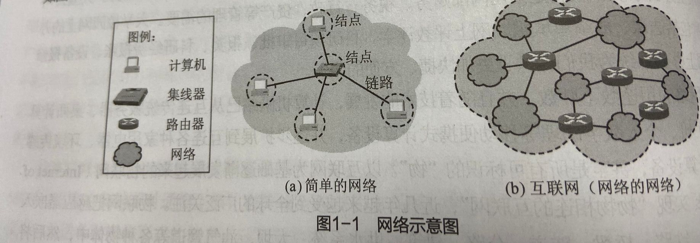
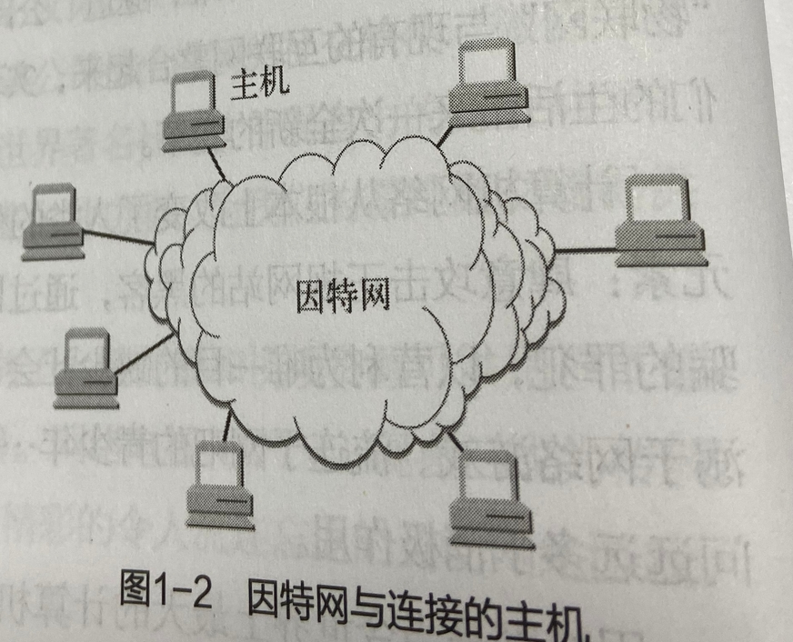
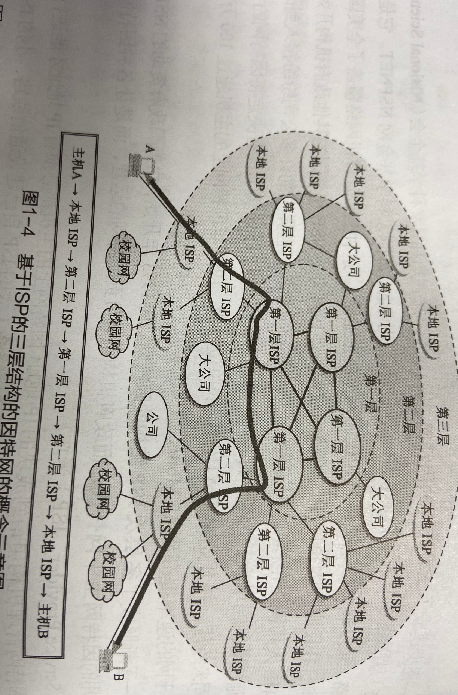
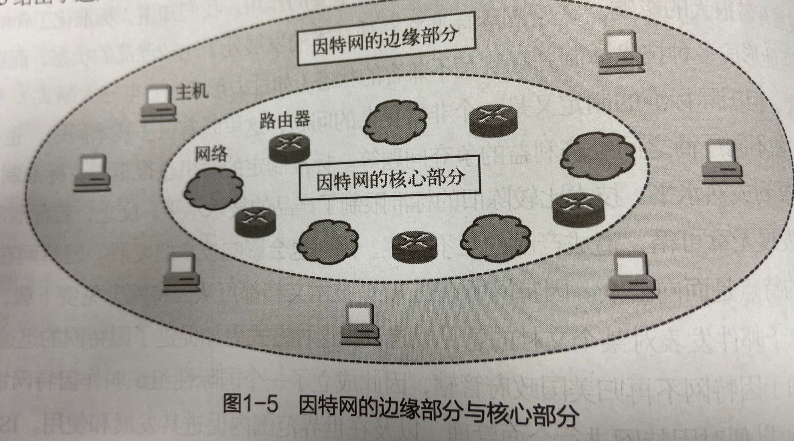
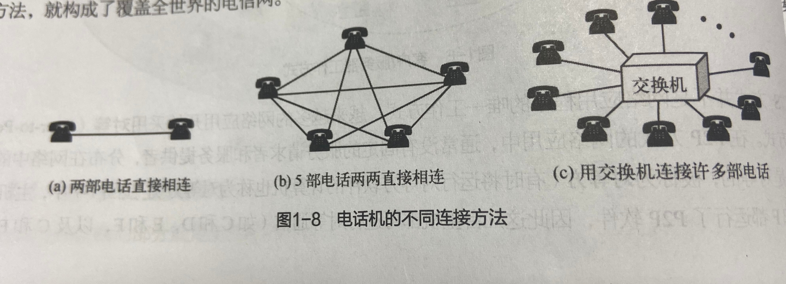
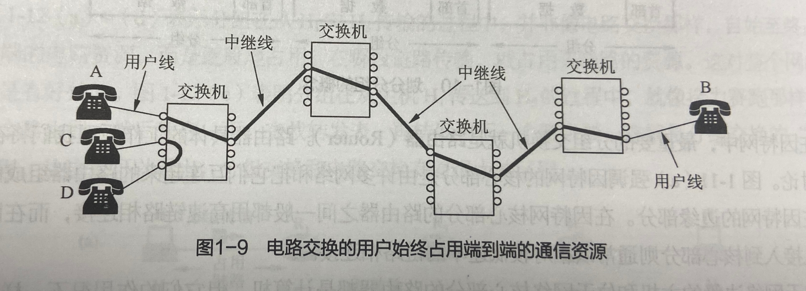

### 网络的网络

------------------
**网络**由若干**结点**和连接这些结点的链路（Link）组成。网络中的结点可以是计算机、集线器、交换机或路由器等。

图a给出了一个具有5个结点和4条链路的网络。我们可以看到，有4台计算机通过4条链路连接到一个集线器上，构成简单的网络。我们可以用一朵云表示一个网络。  
网络还可以通过路由器互联起来，这样就构成了一个覆盖范围更大的网络，即互联网或互连网。如图b，因此互联网是**网络的网络**。



**因特网（Internet）**是世界上最大的互连网络。习惯上，大家把连接在因特网上的计算机称为主机。  
网络把许多计算机连接在一起，而互联网则把许多网络连接在一起。因特网是世界上最大的互联网。




### 因特网发展的三个阶段

------------------
* 第一阶段————单个网络ARPANET向互联网发展
  * 1969年，美国国防部创建的第一个分组交换网ARPANET最初只是一个单个的分组交换网，所有要连接在ARPANET上的主机都直接与就近的结点交换机相连。
  * 1983年，TCP/IP协议成为ARPANET上的标准协议，使得所有使用TCP/IP协议的计算机都能利用互连网相互通信，因此1983年作为因特网的诞生时间。
  * 1990年ARPANET正式关闭，实验任务完成。
  * internet是一个通用名词，它泛指由多个计算机网络互连而成的网络。  
  * Internet则是一个专有名词，它指当前全球最大的、开放的、由众多网络相互连接而成的特定计算机网络，它采用TCP/IP协议簇作为通信的规则，其前世是美国的ARPANET。

* 第二阶段————三级结构的因特网
  * 三级计算机网络分为主干网、地区网和校园网（或企业网）。
  
* 第三阶段————多层次ISP结构的因特网
  * 政府机构不再负责因特网的运营，各种因特网服务提供商（ISP）运营出现。
  * 最高级别的第一层ISP的服务面积一般覆盖国际性区域范围，并拥有高速链路和交换设备。被称为**因特网主干网**。
  * 第二层ISP和一些大公司为第一层ISP的用户，具有区域性或国家性覆盖规模，与第一层ISP相连。
  * 第三层ISP（本地ISP），是第二层ISP的用户，只有本地范围的网络。一般为校园网、企业网、住宅用户和无线移动用户等。
  * 一个ISP可以选择和其他同层ISP相连，当两个同层次ISP相连称为**对等**。
  


主机A与主机B通过因特网进行通信时，实际上就是它们通过许多中间的ISP进行通信。

### 因特网的组成

------------------
**边缘部分**由所有连接在因特网上的主机组成。这部分是用户直接使用的，用来运行各种网络应用，为用户直接提供电子邮件、文件传输、网络音/视频等服务。  
**核心部分**由大量网络和连接这些网络的路由器组成。这部分是为边缘部分提供服务的（提供连接性和数据交换）。

 
 
```
明确概念：主机A与主机B进行通信实际上是A的某个程序和B的另一个程序之间进行通信。“进程”又称为“运行着的程序”，
因此，是主机A的某个进程和主机B的另一个进程进行通信。简称计算机之间通信。
```

C/S工作方式：客户机（Clint）和服务器（Server）多个客户进程请求五福发送到一个服务器进程中。  
p2p工作方式：对等（Peer-to-Peer），没有固定的服务请求者和服务提供者，分布在网络中的应用进程是对等的，被称为对等方。即客户进程可对客户进程。

在网络核心部分起特殊作用的是路由器（Router），它是一种专有的计算机（但不是主机）。路由器是实现分组交换（Packet Switching）的关键构件，其任务是转发接受到的分组。

```
电路交换：拨号通信的过程通过建立一条专用的物理通道进行，这种必须经过3个步骤
建立连接（分配通信资源）——>通话（一直占用通信资源）——>释放连接（归还通信资源）
三个步骤的交换方式称为电路交换。
```




```
分组交换：
```
