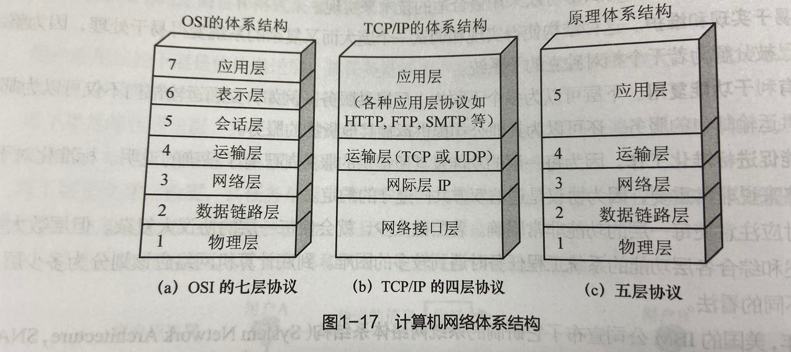
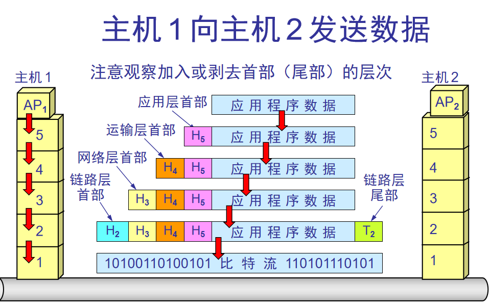
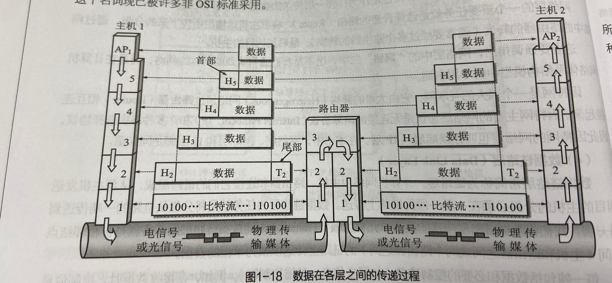
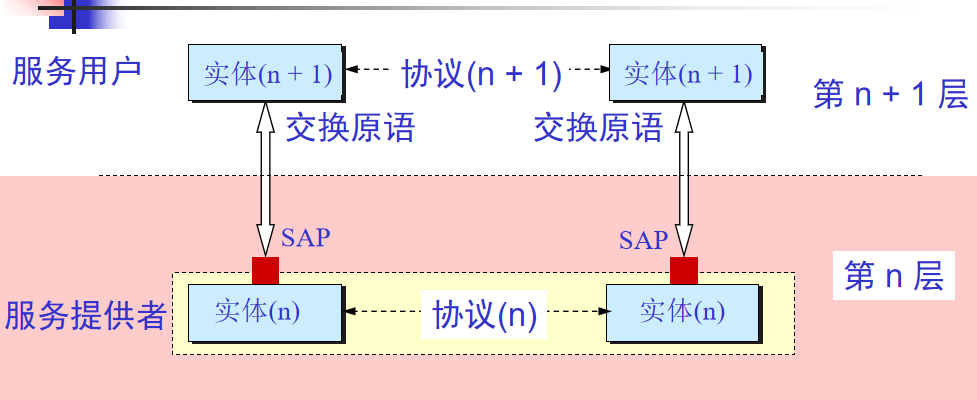
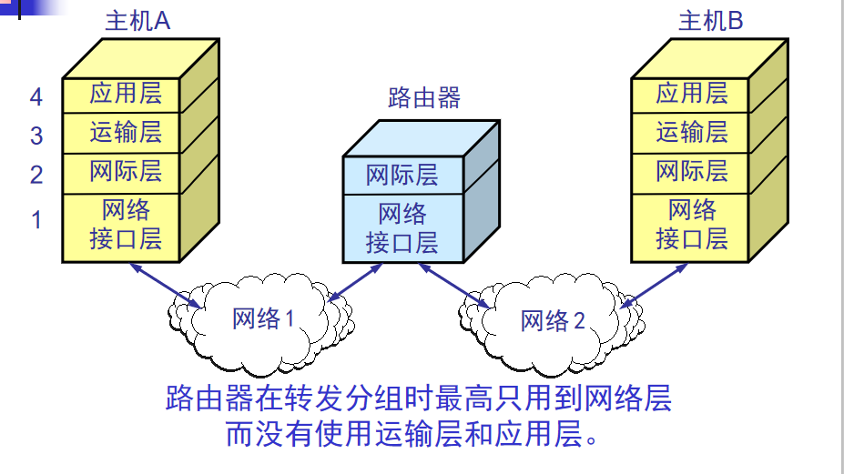
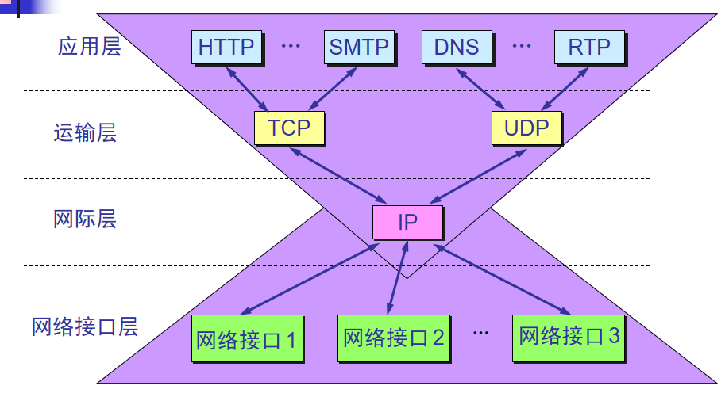

### 网络协议  
这些规则明确规定了所交换的数据的格式和时序，以及在发送或接受数据时要采取的动作等问题。这些为进行网络中数据交换而建立的规则、标准或约定称为网络协议。
三要素构成。  
（1）语法：地址字段多长以及它在整个分组中的什么位置。  
（2）语言：需要发出什么控制信息，完成什么动作和做出什么响应。  
（3）同步：或称时序，数据什么时候发送，数据以什么速率发送。

OSI 7层：  
应用层：任务是如何通过应用进程间的交互来完成特定的网络应用。应用层协议定义是应用进程间通信和交互的规则。（能够产生网络流量能够和用户交互的应用程序。）  
表示层：（加密、压缩 开发人员）    
会话层：（服务和客户端建立的会话 查木马 netstat -nb或者netstat ? 查全部）  

传输层：（可靠传输建立会话 不可靠传输 流量控制）    
网络层：传输层产生的报文段或用户数据报封装成分组或包进行传送（IP地址编制 选择最佳路径）   
数据链路层：计算机网络有主机、路由器和连接它们的链路组成，从源主机发送戳主机的分组必须在一段段链路上传送，单位帧（输入如何封装 添加物理层地址 MAC）  
物理层：传输媒体上传送比特流。单位为比特（电压 接口标准）  

### 实体、协议和服务  
1、实体表示任何可发送或接受信息的硬件或软件进程。  
2、协议是控制两个对等实体（多个实体）进行通信的规则的集合。  
3、在协议的控制下，两个对等实体间的通信使得本层能够向上一层提供服务。

使用本层服务的实体只能看到服务而无法看见下面的协议。下面的协议对上面的实体是透明的。协议是水平的，服务是垂直的。

### TCP/IP的体系结构  

