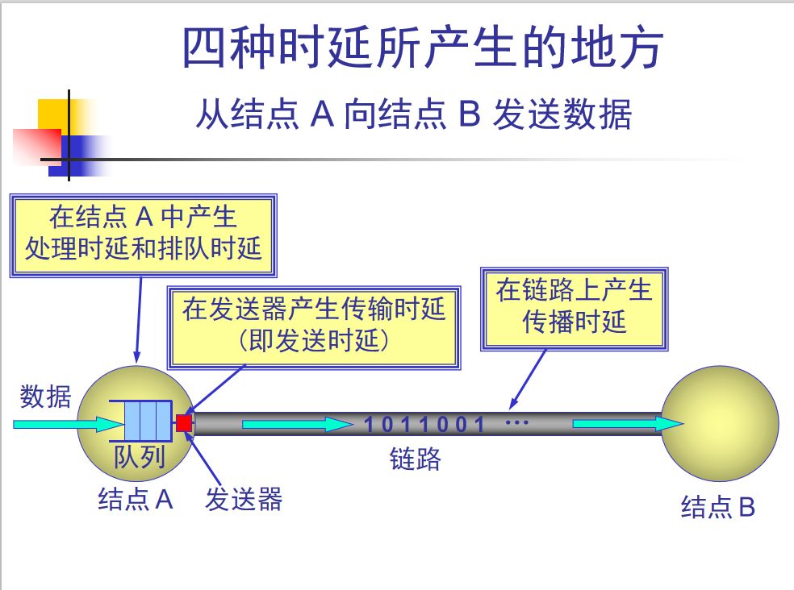
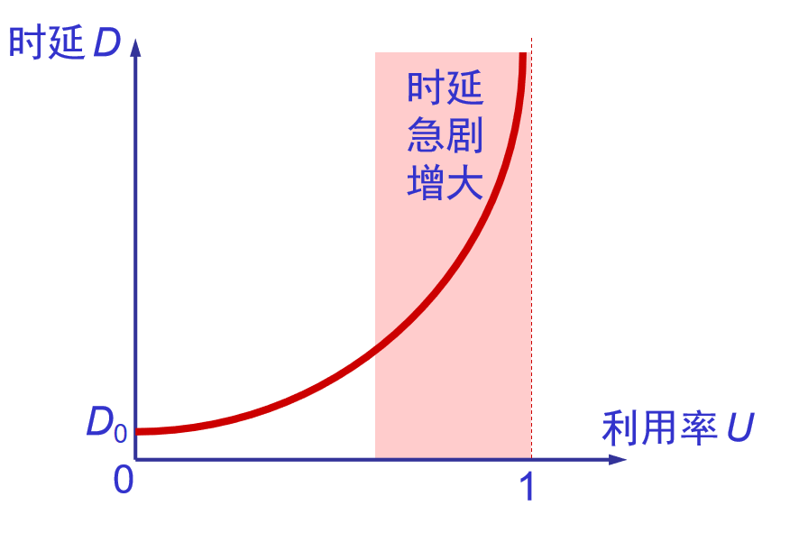

### 速率  
速率就是数据的传送速率，也称为数据率或比特率，是计算机网络中最重要的一个性能指标。  
比特（bit）是计算机中数据量的单位，指代二进制数字。0或1  
单位有bit/s、kbit/s、Mbit/s、Gbit/s、Tbit/s。kbit=1000bit

### 带宽    
带宽有两个不同的意义：  
1、信号的带宽是指某个信号具有的频带宽度，该信号所包含的各种不同频率成分所占据的频率范围（如电话信号标准带宽是3.1KHz，从300Hz到3.4kHz）。单位为赫、
千赫、兆赫、吉赫。通过线路允许通过的信号频带范围就称为线路的带宽。
2、网络的通信线路所能传送的能力，单位时间内从网络中的某一点到另一点所通过的**最高数据率**称为带宽。

### 吞吐量  
表示单位时间内通过某个网络的数据量。（比如边下载边看电影，看电影2M，下载4M，则吞吐量就是6M）

### 时延  
是指数据从网络的一端到另一端的所需时间，也称为延迟或迟延。  
（1）发送时延：从发送分组的第一个比特到该分组的最后一个比特送到线路上所使用的时间。=分组长度/发送速率  
（2）传播时延：电磁波在信道中需要传播一定距离而花费的时间。=信道长度/电磁波在信道上的传播速率  
（3）处理时延：主机或路由器在受到分组时要花费一定的时间进行处理。  
（4）排队时延：分组在进入路由器后要先在输入队列中排队等待处理。

结点时延 = 发送时延+传播时延+处理时延+排队时延

网络的时延越小越好，但不是网络速率高就时延就小。比如，在高速网络链路，传播时延只有5us，而发送时延=分组长度/发送速率，如果分组长度很大，发送速率也挺高的时候，所需要的时间就会远大与传播时延。如果分组长度很小，发送速率挺高时，发送时延就有可能小于传播时延，这时候传播时延就是主要的结点时延，再怎么提高网络速率也没办法改变结点时延

### 丢失率  
在一定时间范围内，分组在传输过程中丢失的分组数量与总的分组数量的比率。可分为接口丢包率、结点丢包率、链路丢包率、路径丢包率和网络丢包率等。

### 利用率  
分为信道利用率和网络利用率  
1、信道利用率指出某信道有百分之几的时间是被利用的（有数据通过）。完全空闲的信道的利用率为零。  
2、网络利用率是全网络的信道利用率的加权平均值。  
信道利用率不是越高越好，就好像高速公路，车多了就会堵，时延就会大。  
网络当前时延D=网络空闲时时延D0/1-U利用率

