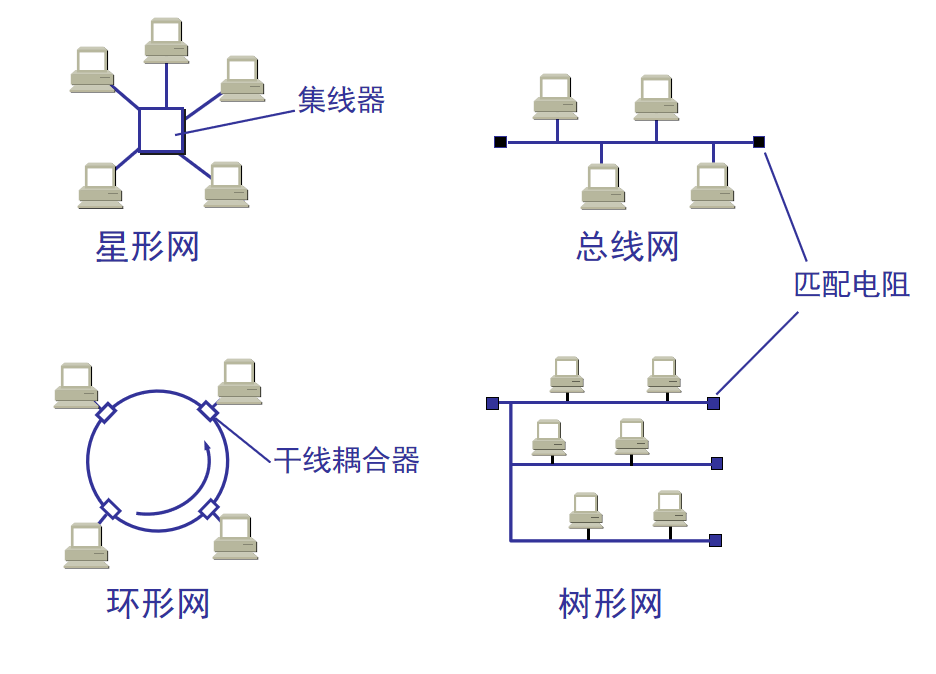
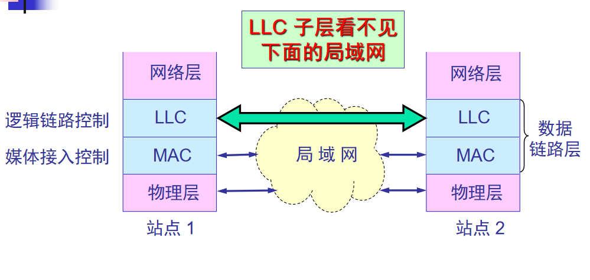

### 媒体接入控制

---------------
共享信道要着重考虑的一个问题是如何协商多个发送和接受站点对一个共享传输媒体的占用，即**媒体接入控制**或**多址接入**问题。  
媒体接入控制技术分为：  
（1）静态划分信道：频分复用、时分复用、波分复用、码分复用   
（2）动态接入控制：  
随机接入：随机接入的特点是所有站点通过竞争，随机地在信道上发送数据。著名的共享式以太网采用。  
受控接入：受控接入的特点是结点不能随机地发送信息而必须服从一定的控制。如多点线路探询(polling)，或轮询。  

### 局域网

----------------
局域网特点：网络为一个单位所拥有，且地理范围和站点数目有限
```
以太网的两个标准
DIX Ethernet V2 是世界上第一个局域网产品（以太网）的规约。
IEEE 的 802.3 标准。
DIX Ethernet V2 标准与 IEEE 的 802.3 标准只有很小的差别，因此可以将 802.3 局域网简称为“以太网”。
严格说来，“以太网”应当是指符合 DIX Ethernet V2 标准的局域网  
```



为了使数据链路层能更好地适应多种局域网标准，802 委员会就将局域网的数据链路层拆成两个子层： 
（1）逻辑链路控制 LLC (Logical Link Control)子层。  
（2）媒体接入控制 MAC (Medium Access Control)子层。  
与接入到传输媒体有关的内容都放在 MAC子层，而 LLC 子层则与传输媒体无关，不管采用何种协议的局域网对LLC 子层来说都是透明的 



```
以后一般不考虑 LLC 子层 
由于 TCP/IP 体系经常使用的局域网是 DIX Ethernet V2 而不是 802.3 标准中的几种局域网，  
因此现在 802 委员会制定的逻辑链路控制子层 LLC（即 802.2 标准）的作用已经不大了。  
很多厂商生产的适配器上就仅装有 MAC 协议而没有 LLC 协议。  
```

网络接口板又称为通信适配器(adapter)或网络接口卡 NIC (Network Interface Card)，或“网卡”。 
适配器的重要功能：进行串行/并行转换。对数据进行缓存。在计算机的操作系统安装设备驱动程序。实现以太网协议。


MAC地址：多个站点连接在同一个广播信道上时想实现两个站点的通信，则每个站点必须有一个唯一的标识，即一个数据链路层地址  
802标准为局域网规定了一种48位的全球地址，是指局域网上每一台计算机固化在适配器（网卡）ROM中的地址。  
IEEE的注册管理机构（RA）是局域网全球地址的法定管理机构，前24位即3个字节是公司标识符，如3Com公司生产的MAC适配器前三个字节是02-60-8C。后3个字节  
为厂家自行指派。  


