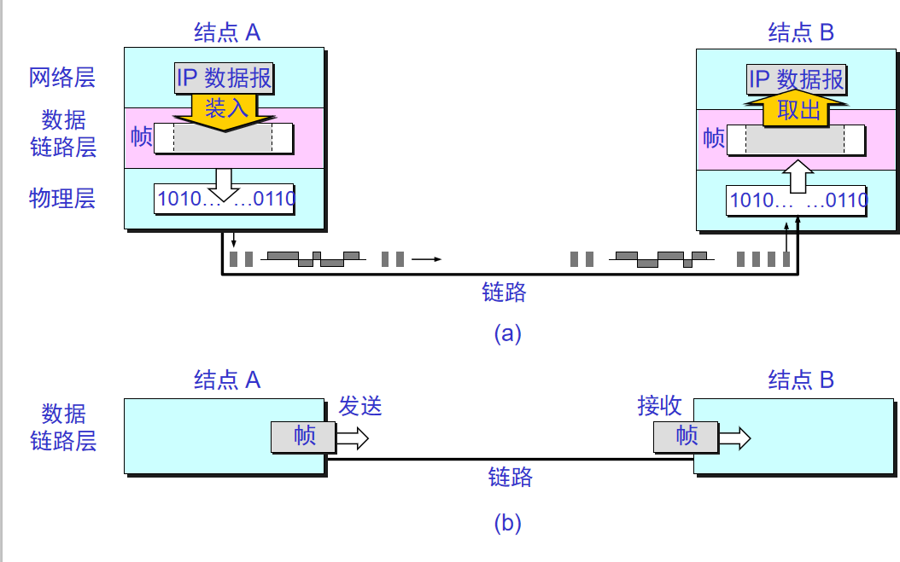
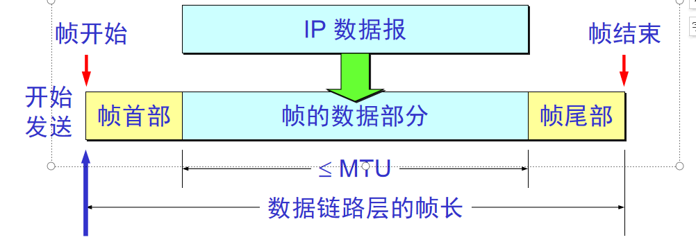
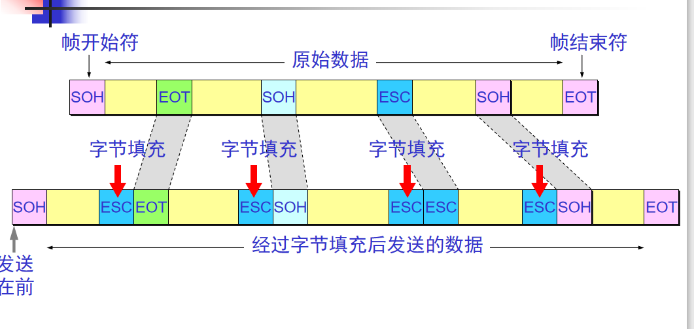
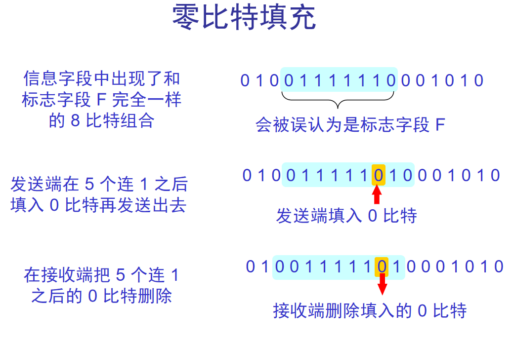

链路：从一个结点到相邻结点的一段物理线路，而中间没有任何其他的交换结点。  
数据链路：除了必须有一条物理线路外，还必须有一些必要的通信协议来控制这些数据的传输。  
帧：数据链路层的协议数据单位。（数据链路层把网络层交下来的数据构成帧发送到链路上，以及把接受到的帧中的数据去除并上交给网络层。网络协议数据单元就是  
IP数据包或称数据报、分组、包）  

### 封装成帧

------------
网络层的IP数据报必须向下传送到数据链路层，成为帧的数据部分。  
封装成帧(framing)就是在一段数据的前后分别添加首部和尾部，然后就构成了一个帧。确定帧的界限。  
首部和尾部的一个重要作用就是进行**帧定界**。

1、当物理链路提供的是面向字符的传输服务（物理链路以字符为单位传输数据），帧定界标志可使用特殊不可打印的控制字符作为帧定界符。（ASCII码为7位编码，一共128  
不同ASCII码，其中95个可打印，33个无法打印）  
2、当数据部分非ASCII码时（如程序或图片汉字等），如果数据中的某个字节的二进制代码恰好是帧定界符一样。则需要数据链路层提供**透明传输**  
对于面对字符的物理链路，可以使用字节填充或字符填充。在数据链路层的数据中出现标记字符前面插入**转义字符**（如ESC字符）。  

3、当物理链路层提供的是面向比特的传输服务时（即连续的比特流），帧定界标志可使用某个特别的比特组合，如：PPP协议所使用的零比特填充法“01111110”。  

### 差错检测

--------------

