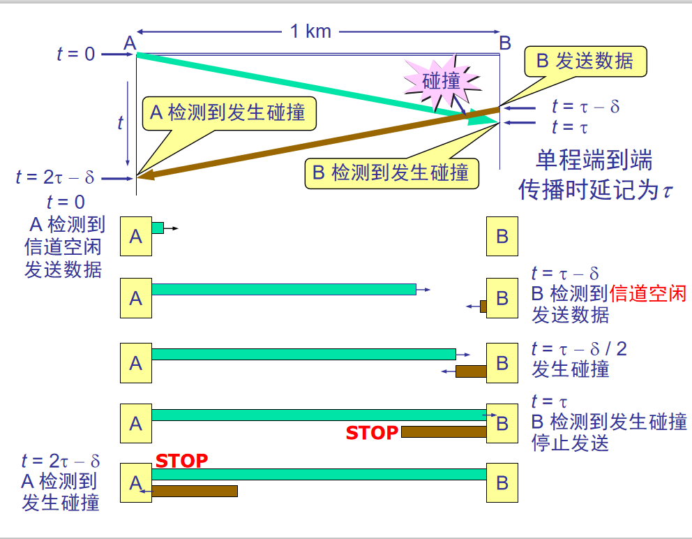
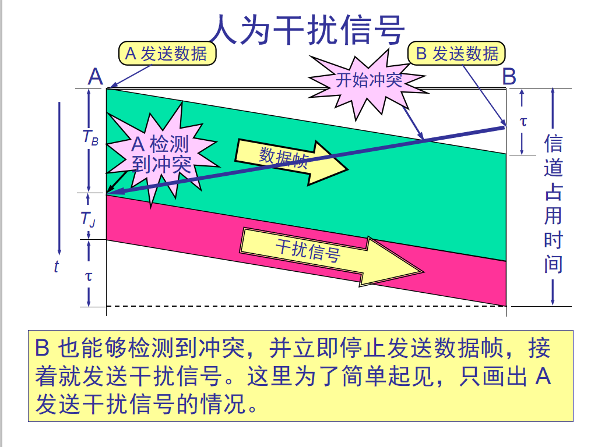
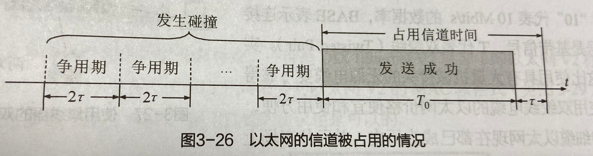
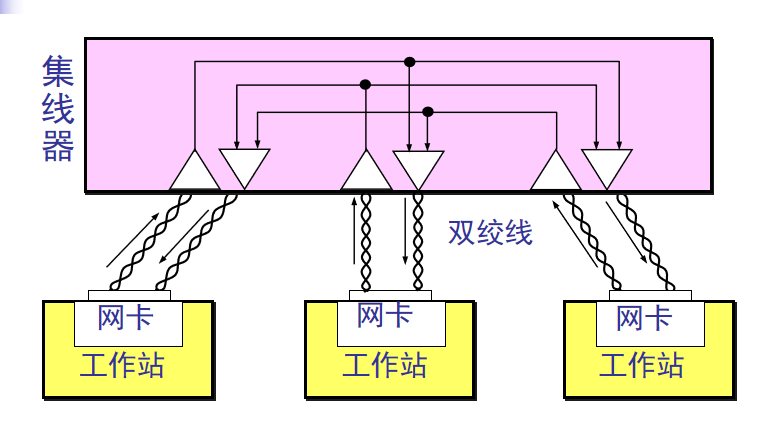
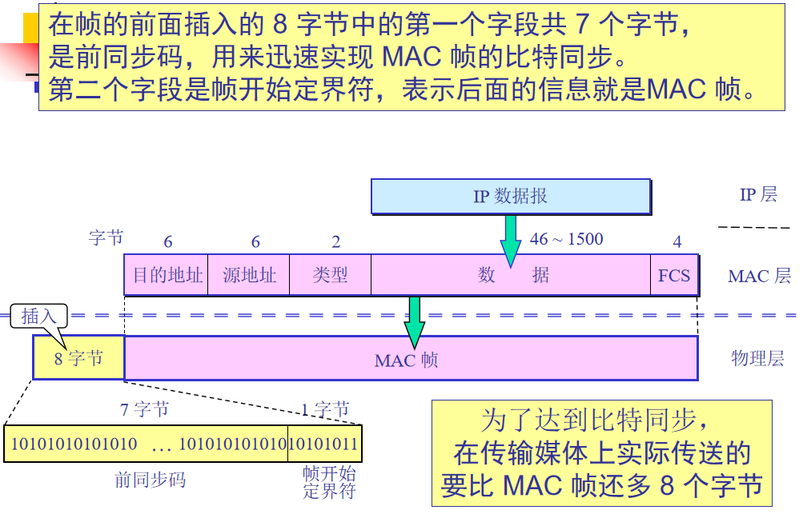

### CSMA/CD协议

---------------------
为了通信的简便以太网采取了两种重要的措施：  
（1）采用较为灵活的无连接的工作方式，即不必先建立连接就可以直接发送数据。是不可靠的服务，如果帧有差错（使用CRC检验）则丢弃，是否重发由高层决定。
（2）以太网采用基带传输，发送的数据都使用曼彻斯特编码的信号。曼彻斯特编码在每一个比特信号中间都会发生一次电平的跳变，接收端可根据跳变提取信号时钟频率。  

如何在同一时间只能允许一个站点发送数据，否则无法正常发送数据？  
CSMA/CD 表示 Carrier Sense Multiple Access with Collision Detection。  
**多点接入**表示许多计算机以多点接入的方式连接在一根总线上。  
**载波监听**是指每一个站在发送数据之前先要检测一下总线上是否有其他计算机在发送数据，如果有，则暂时不要发送数据，以免发生碰撞。   
总线上并没有什么“载波”。因此， “载波监听”就是用电子技术检测总线上有没有其他计算机发送的数据信号。（作用在发送端，无法监听总线正在传送）  
**碰撞检测**就是计算机边发送数据边检测信道上的信号电压大小。  
当几个站同时在总线上发送数据时，总线上的信号电压摆动值将会增大（互相叠加）。  
当一个站检测到的信号电压摆动值超过一定的门限值时，就认为总线上至少有两个站同时在发送数据，表明产生了碰撞。  
所谓“碰撞”就是发生了冲突。因此“碰撞检测”也称为“冲突检测”。  

为什么还会出现数据在总线上的碰撞呢？  
因为电磁波在总线上总是以有限的速率传播的。当某个站点监听到总线是空闲的，但总线并非一定是空闲的。  
局域网两端的站点A和B相距1km，用同轴电缆相连。电磁波在1km电缆的传播时延约5us。因此，A向B发出的信号，在约5us后B接收到。这段时间内载波监听认为没有人在发送 
占用总线。



由于局域网任意两个站点之间的传播时延不同，因此局域网必须按最坏情况设计，即取总线两端的两个站点之间的传播时延（两个站点的最大距离）为端到端传播时延2r。  
CSMA/CD协议无法进行全双工通信，只能进行半双工通信。  
以太网的端到端往返时间2r称为争用起，又称为碰撞窗口。这是因为一个站点在发送完整数据后，只有通过争用期的考验，才可以不发生碰撞，顺利完成通信。  

因此以太网不能连接太多的站点，总线不能太长，否则容易发生碰撞。10Mbit/s以太网把争用期定位512比特发送时间，即51.2us，因此总线长度不能超过5120m，因为其他 
一些因素，如信号衰减，以太网规定总线长度不能超过2500m。  （端到端发送时延为51.2us，传播时延为25.6us，因为发送时延是传播时延的两倍，所以传播完成了，才有可能有人发送下一次）

发生碰撞的站点不能在等待信道变成空闲后立即再发送数据，否则还会导致碰撞。以太网使用截断二进制指数退避算法来解决碰撞后何时进行重传的问题。  

```
二进制指数类型退避算法  
发生碰撞的站在停止发送数据后，要推迟（退避）一个随机时间才能再发送数据。  
确定基本退避时间，一般是取为争用期 2r。
定义重传次数 k ，k 小于等于 10，即
                 k = Min[重传次数, 10]
从整数集合[0,1,…, (2k（小k在2头上）- 1)]中随机地取出一个数，记为 t。重传所需的时延就是 t 倍的基本退避时间（两端在k区间中取，当取值相同，则发送撞撞
当重传达 16 次仍不能成功时即丢弃该帧，并向高层报告。 
```

**强化碰撞**
当发送数据的站一旦发现发生了碰撞时： 
立即停止发送数据；  
再继续发送若干比特的人为干扰信号(jamming signal)，以便让所有用户都知道现在已经发生了碰撞。    



CSMA/CD协议要点归纳：  
（1）适配器从网络层获得一个分组，加上以太网的首部和尾部，组为以太网网帧，放入适配器的缓存中，准备发送。  
（2）若适配器检测到信道空闲96比特时间，就发送这个帧，若检测到信道忙，则继续检测并等待信道转为空闲96比特时间，然后发送这个帧（为了接收方检测这个帧结束）  
（3）发送过一次中继续检测信道，若一直未检测到碰撞，就顺利把这个帧成功发送完毕。若检测到碰撞，则中止发送数据，并发送人为干扰。  
（4）在中止发送后，适配器就执行指数退避算法，随机等待t倍512比特时间，再执行（2）。  

### 共享以太网的信道利用率  

------------------------



要提高以太网的信道利用率，就必须减小r与T0之比。  
单程端对端时延r与帧的发送时间T0之比a=r/T0  
说明以太网的连接的长度收到限制（否则r的数值会太大，浪费信道资源），同时以太网的帧长不能太短。
极限信道利用率Smax = T0/T0+r = 1/1+a

### 使用集线器的星形拓扑

------------------------
传统以太网最初使用粗同轴电缆——>细同轴电缆——>双绞线  
使用集线器作为星形拓扑的中心。双绞线两端是用RJ-45水晶头插头。   
使用集线器的以太网逻辑上还是一个总线网，各站点共享逻辑上的总线，使用的还是CSMA/DA协议（各站点的适配器执行CSMA/DA协议）。在一时刻允许一个站点发送数据  
集线器作用与物理层。    



### 以太网的帧格式

-----------------------



类型字段用来标志上一层使用的是什么协议，以便把收到的 MAC 帧的数据上交给上一层的这个协议。  
数据字段的正式名称是 MAC 客户数据字段，最小长度 64 字节 - 18 字节的首部和尾部 = 数据字段的最小长度。 （64字节就是512bit——>一字节=8bit）  
FCS是CRC循环冗余检验  

```
无效的 MAC 帧 
数据字段的长度与长度字段的值不一致；
帧的长度不是整数个字节；
用收到的帧检验序列 FCS 查出有差错；
数据字段的长度不在 46 ~ 1500 字节之间。
有效的 MAC 帧长度为 64 ~ 1518 字节之间。
对于检查出的无效 MAC 帧就简单地丢弃。以太网不负责重传丢弃的帧。 
```
