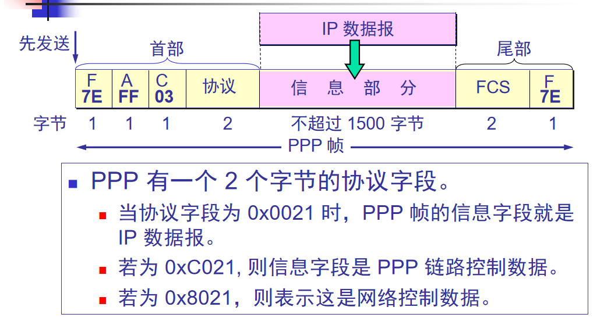
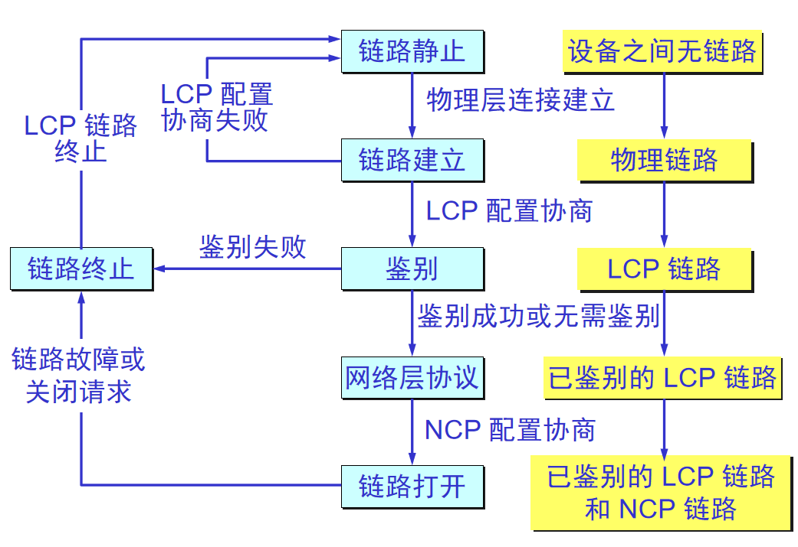

### PPP的特点

---------------
（1）简单：接收方每收到一个帧，就进行CRC检验。使用PPP的数据链路层向上提供不可靠传输服务，如需可靠传输，则由运输层完成。  
（2）封装成帧：PPP规定了特殊的字符作为帧定界符。  
（3）透明性：PPP能够保证数据传输的透明性。  
（4）多种网络层协议和多种类型链路。  
（5）差错检测：接收端收到的帧进行差错检测不进行纠错，错误的丢掉。如果不检验，错误的帧还在网络中继续转发，浪费资源。  
（6）检测连接状态：自动检验是否处于正常工作状态。  
（7）最大传送单元：最大传送单元MTU（默认至少1500字节），如果高层协议发送的分组过长超过MTU则丢弃帧。MTU是帧数据部分的最大长度。  
（8）网络层地址协商：PPP提供了一种机制使通信的两个网络层（例如，两个IP层）实体能够通过协商知道或配置彼此的网路层地址。

### PPP的组成

---------------
（1）一个将 IP 数据报封装到串行链路的方法。  
（2）链路控制协议 LCP (Link Control Protocol)  
（3）网络控制协议 NCP (Network Control Protocol)。 

### PPP协议的帧格式

----------------
标志字段 F = 0x7E （符号“0x”表示后面的字符是用十六进制表示。十六进制的 7E 的二进制表示是 01111110）。  
地址字段 A 只置为 0xFF。地址字段实际上并不起作用。无作用  
控制字段 C 通常置为 0x03。无作用   
PPP 是面向字节的，所有的 PPP 帧的长度都是整数字节。  

透明传输问题：  
当 PPP 用在同步传输链路时，协议规定采用硬件来完成比特填充（和 HDLC 的做法一样）可查（使用点对点信道的数据链路层.md）。   
当 PPP 用在异步传输时，就使用一种特殊的字符填充法。   
特殊字符填充法：  
（1）采用转义符0x7D，将信息字段中出现的每一个 0x7E 字节转变成为 2 字节序列(0x7D, 0x5E)。   
（2）若信息字段中出现一个 0x7D 的字节, 则将其转变成为 2 字节序列(0x7D, 0x5D)。  
（3）若信息字段中出现 ASCII 码的控制字符（即数值小于 0x20 的字符），则在该字符前面要加入一个 0x7D 字节，同时将该字符的编码加以改变。  

### ppp工作状态

----------------
当用户拨号接入 ISP 时，路由器的调制解调器对拨号做出确认，并建立一条物理连接。  
PC 机向路由器发送一系列的 LCP 分组（封装成多个 PPP 帧）。  
这些分组及其响应选择一些 PPP 参数，和进行网络层配置，NCP 给新接入的 PC机分配一个临时的 IP 地址，使 PC 机成为因特网上的一个主机。  
通信完毕时，NCP 释放网络层连接，收回原来分配出去的 IP 地址。接着，LCP 释放数据链路层连接。最后释放的是物理层的连接。

