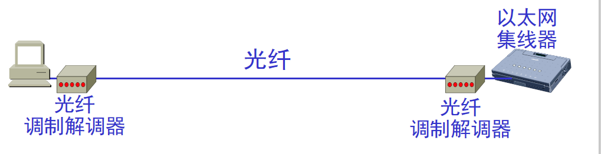
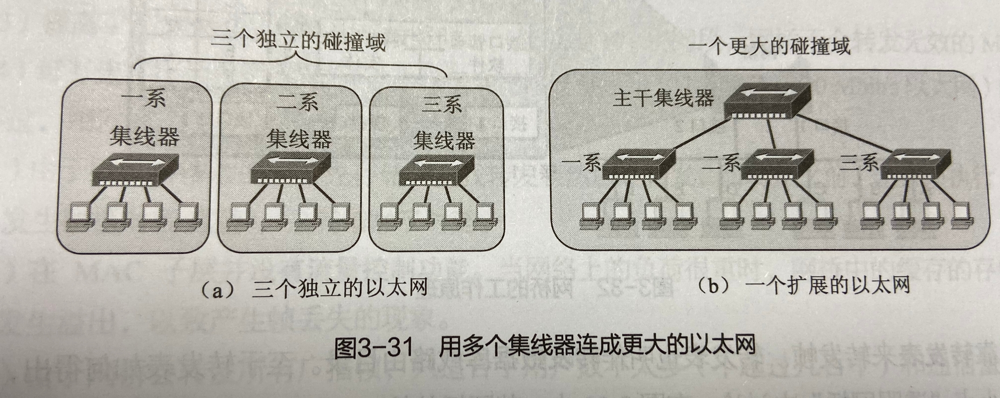
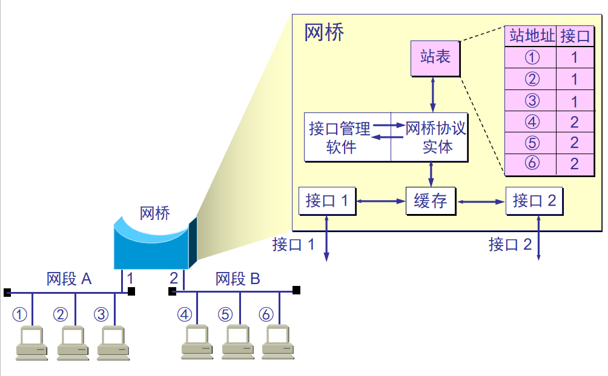
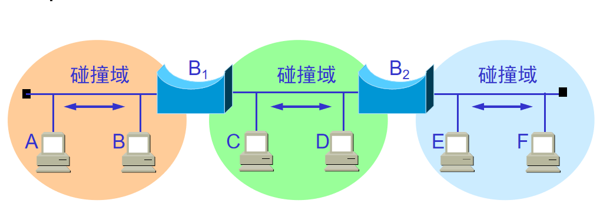
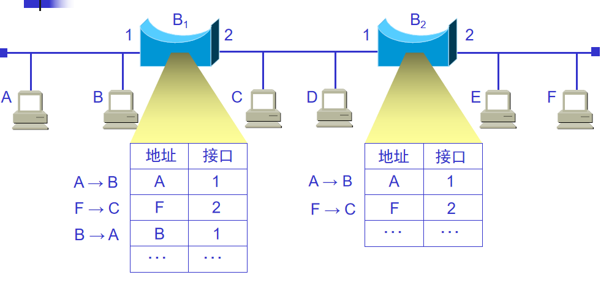
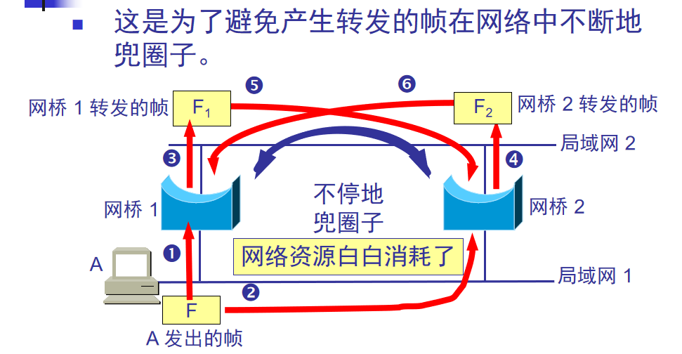
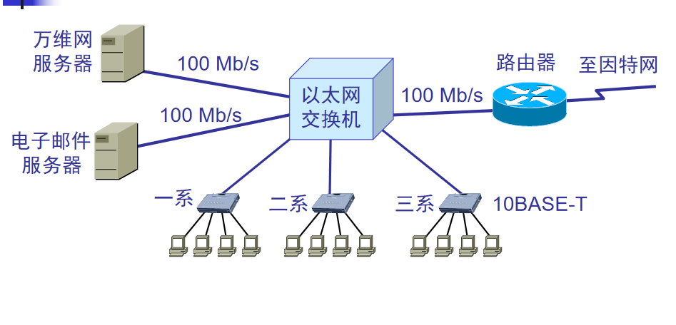
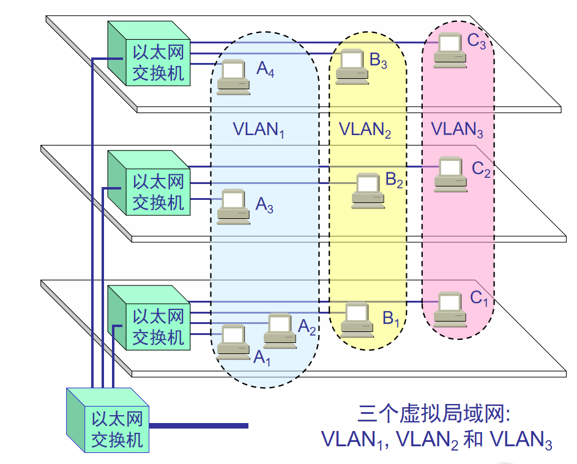
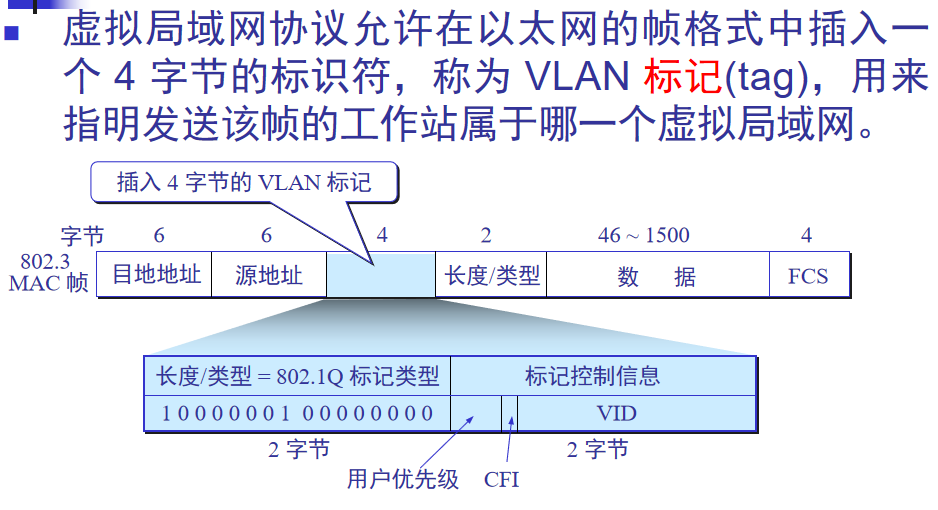

### 在物理层扩展局域网

-------------------
集线器作用于物理层。  
以太网两站之间距离不能太远，否则站点发送的信号经过铜线的传输会衰减到使CSMA/DA协议无法正常工作。  
IEEE802.3标准规定，任意两个站点之间最多可以经过三个电缆网段。随着双绞线称为主流，很少使用转发器。  
现在扩展站点和集线器之间的距离是使用光纤和一对光纤调制解调器。  



单个集线器能连接的站点数非常有限，如果使用多个集线器，就可以连接覆盖更改的范围。  



CSMA/DA协议，只允许一方发送数据。当随机两个站点发送数据会通过所有集线器，其他站的内部就无法发送数据，否则会发生碰撞。  
本来一个碰撞域内还能两两发送，形成一个更大的碰撞域后，更多的站点无法发送。  

### 在数据链路层扩展以太网

------------------------
网桥作用于数据链路层，采用存储转发方式。  
当网桥收到一个帧，并不是向所有的接口转发此帧，而是先检查此帧的目的MAC地址，然后再确定将该帧妆发到哪一个接口，或者把它丢弃。  
两个以太网通过网桥连接后，就成为了一个更大覆盖范围的以太网。  



```
使用网桥带来的好处 
过滤通信量。 
扩大了物理范围。
提高了可靠性。
可互连不同物理层、不同 MAC 子层和不同速率（如10 Mb/s 和 100 Mb/s 以太网）的局域网。
```

网桥使各网段成为隔开的碰撞域



```
使用网桥带来的缺点 
存储转发增加了时延。 
在MAC 子层并没有流量控制功能。 
具有不同 MAC 子层的网段桥接在一起时时延更大。
网桥只适合于用户数不太多(不超过几百个)和通信量不太大的局域网，否则有时还会因传播过多的广播信息而产生网络拥塞。这就是所谓的广播风暴。  
```

```
网桥和集线器（或转发器）不同  
集线器在转发帧时，不对传输媒体进行检测。  
网桥在转发帧之前必须执行 CSMA/CD 算法。  
若在发送过程中出现碰撞，就必须停止发送和进行退避。  
```

### 透明网桥

----------------
“透明”是指局域网上的站点并不知道所发送的帧将经过哪几个网桥，因为网桥对各站来说是看不见的。  
透明网桥是一种即插即用设备，其标准是 IEEE 802.1D。  




网桥应当按照以下自学习算法处理收到的帧和建立转发表  
网桥每收到一个帧，就记下其源地址和进入网桥的接口，作为转发表中的一个项目。  
在建立转发表时是把帧首部中的源地址写在“地址”这一栏的下面。  
在转发帧时，则是根据收到的帧首部中的目的地址来转发的。这时就把在“地址”栏下面已经记下的源地址当作目的地址，而把记下的进入接口当作转发接口。  

### 透明网桥使用了生成树算法 

-------------------------



### 以太网交换机

---------------------
1990 年问世的交换式集线器(switching hub)，可明显地提高局域网的性能。  
交换式集线器常称为以太网交换机(switch)或第二层交换机（表明此交换机工作在数据链路层）。  
以太网交换机通常都有十几个接口。因此，以太网交换机实质上就是一个多接口的网桥，可见交换机工作在数据链路层。  

以太网交换机的特点：  
以太网交换机的每个接口都直接与主机相连，并且一般都工作在全双工方式。  
交换机能同时连通许多对的接口，使每一对相互通信的主机都能像独占通信媒体那样，进行无碰撞地传输数据。   
以太网交换机由于使用了专用的交换结构芯片，其交换速率就较高。      



为了提高交换机的转发时延，采用直通的交换方式。  
直接交换不必把整个帧先缓存后再进行处理，而是接收帧的同时立即按帧的目的MAC地址转发。  
采用直通交换方式，并不表示不会进存储转发，而说一个交换机采用存储转发交换方式，是指交换机仅采用存储转发进行交换。

### 虚拟局域网VLAN

----------------
利用以太网交换机可以很方便地实现虚拟局域网  
虚拟局域网 VLAN 是由一些局域网网段构成的与物理位置无关的逻辑组。  
这些网段具有某些共同的需求。  
每一个 VLAN 的帧都有一个明确的标识符，指明发送这个帧的工作站是属于哪一个 VLAN。  
虚拟局域网其实只是局域网给用户提供的一种服务，而并不是一种新型局域网。   





```
使用虚拟局域网的优点
（1）简化网络管理
（2）控制广播风暴
（3）增强网络的安全性
```


