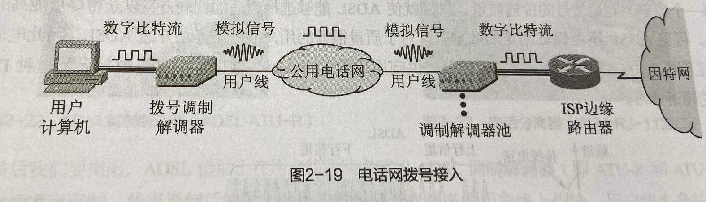

### 电话网拨号接入

---------------
具有简单易行成本低的优点。  
为了提高速率，ISP路由器通常使用数字专线直接接入电话交换机（不再通过模拟电话用户线），以减小ISP一侧的模/数转换过程。  
电话网将标准话音的带宽限制在4kHz内，再加上噪音，利用各种技术拨号调制解调器最高上网速率不超过56kbit/s。  
无法同时打电话上网。

### 数字用户线接入
xDSL 技术就是用数字技术对现有的模拟电话用户线进行改造，使它能够承载宽带业务。  
虽然标准模拟电话信号的频带被限制在 300到3400 kHz 的范围内，但用户线本身实际可通过的信号频率仍然超过 1 MHz。   
xDSL 技术就把 0~4 kHz 低端频谱留给传统电话使用，而把原来没有被利用的高端频谱留给用户上网使用。  
DSL 就是数字用户线(Digital Subscriber Line)的缩写。而 DSL 的前缀 x 则表示在数字用户线上实现的不同宽带方案。  

ADSL (Asymmetric Digital Subscriber Line)：非对称数字用户线  
HDSL (High speed DSL)：高速数字用户线  
SDSL (Single-line DSL)：1 对线的数字用户线  
VDSL (Very high speed DSL)：甚高速数字用户线  
DSL ：ISDN 用户线。  
RADSL (Rate-Adaptive DSL)：速率自适应  DSL，是 ADSL 的一个子集，可自动调节线路速率）。   

ADSL特点： 
上行和下行带宽做成不对称的。  
上行指从用户到 ISP，而下行指从 ISP 到用户。  
ADSL 在用户线（铜线）的两端各安装一个 ADSL 调制解调器。  
我国目前采用的方案是离散多音调 DMT (Discrete Multi-Tone)调制技术。这里的“多音调”就是“多载波”或“多子信道”的意思。  

DMT 调制技术采用频分复用的方法，把 40 kHz 以上一直到 1.1 MHz 的高端频谱划分为许多的子信道，其中 25 个子信道用于上行信道，  
而 249 个子信道用于下行信道。  
每个子信道占据 4 kHz 带宽（严格讲是 4.3125 kHz），并使用不同的载波（即不同的音调）进行数字调制。  
这种做法相当于在一对用户线上使用许多小的调制解调器并行地传送数据。  

---------------

### 光纤同轴混合网接入（HFC）

---------------
HFC 网是在目前覆盖面很广的有线电视网 CATV 的基础上开发的一种居民宽带接入网。  
HFC 网除可传送 CATV 外，还提供电话、数据和其他宽带交互型业务。  
现有的 CATV 网是树形拓扑结构的同轴电缆网络，它采用模拟技术的频分复用对电视节目进行单向传输。而 HFC 网则需要对 CATV 网进行改造。   

特点：  
(1) HFC网的主干线路采用光纤    
HFC 网将原 CATV 网中的同轴电缆主干部分改换为光纤，并使用模拟光纤技术。  
在模拟光纤中采用光的振幅调制 AM，这比使用数字光纤更为经济。    
模拟光纤从头端连接到光纤结点(fiber node)，即光分配结点 ODN (Optical Distribution Node)。在光纤结点光信号被转换为电信号。  
在光纤结点以下就是同轴电缆。   

（2）HFC网采用结点体系结构  

(3) HFC 网具有比 CATV 网更宽的频谱，且具有双向传输功能  

(4) 每个家庭要安装一个用户接口盒  
用户接口盒 UIB (User Interface Box)要提供三种连接，即：  
使用同轴电缆连接到机顶盒(set-top box)，然后再连接到用户的电视机。  
使用双绞线连接到用户的电话机。  
使用电缆调制解调器连接到用户的计算机。  

电缆调制解调器是为 HFC 网而使用的调制解调器。  
电缆调制解调器最大的特点就是传输速率高。其下行速率一般在 310  Mb/s之间，最高可达 30 Mb/s，而上行速率一般为 0.22 Mb/s，最高可达 10 Mb/s。  
电缆调制解调器比在普通电话线上使用的调制解调器要复杂得多，并且不是成对使用，而是只安装在用户端。   

HFC 网的最大优点：  
具有很宽的频带，并且能够利用已经有相当大的覆盖面的有线电视网。  
要将现有的 450 MHz 单向传输的有线电视网络改造为 750 MHz 双向传输的 HFC 网（还要将所有的用户服务区互连起来而不是一个个 HFC 网的孤岛），  
也需要相当的资金和时间。  
在电信政策方面也有一些需要协调解决的问题  

### 光纤接入

---------------
FTTx（光纤到……）也是一种实现宽带居民接入网的方案。这里字母 x 可代表不同意思。  
光纤到家 FTTH (Fiber To The Home)：光纤一直铺设到用户家庭可能是居民接入网最后的解决方法。  
光纤到大楼 FTTB (Fiber To The Building)：光纤进入大楼后就转换为电信号，然后用电缆或双绞线分配到各用户。  
光纤到路边 FTTC (Fiber To The Curb)：从路边到各用户可使用星形结构双绞线作为传输媒体。  

### 以太网接入

---------------
成本低、高性能和使用方便

### 无线接入 

---------------
带来便利
