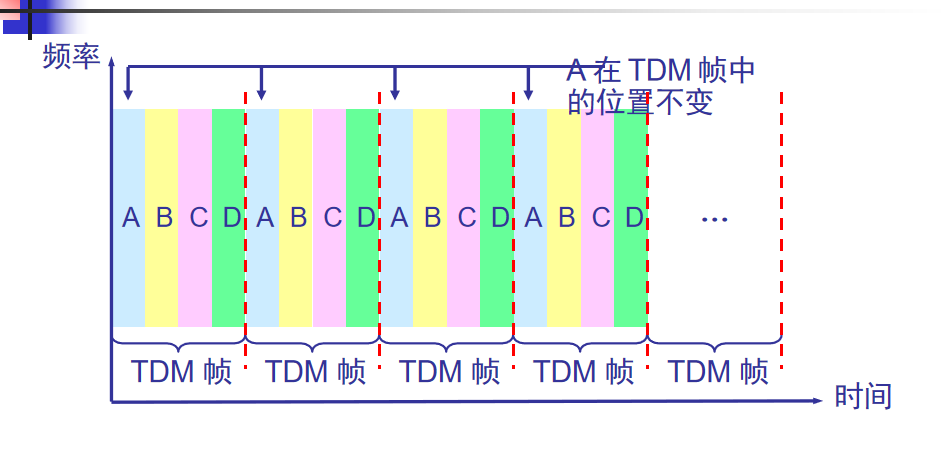
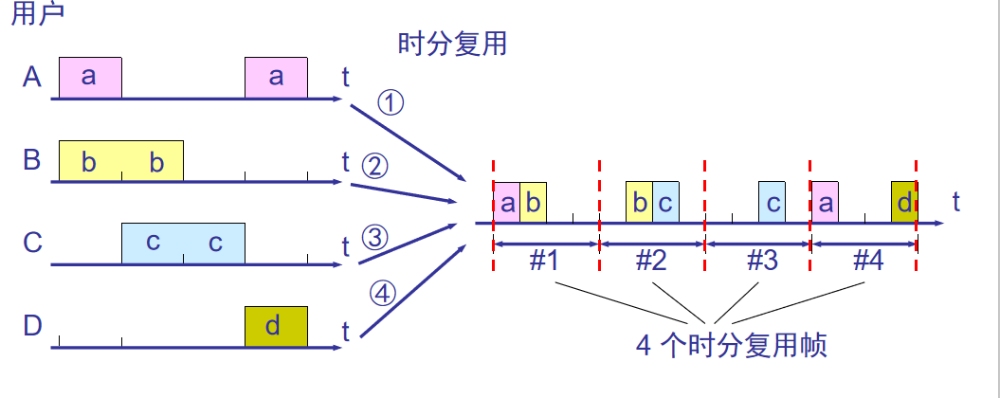
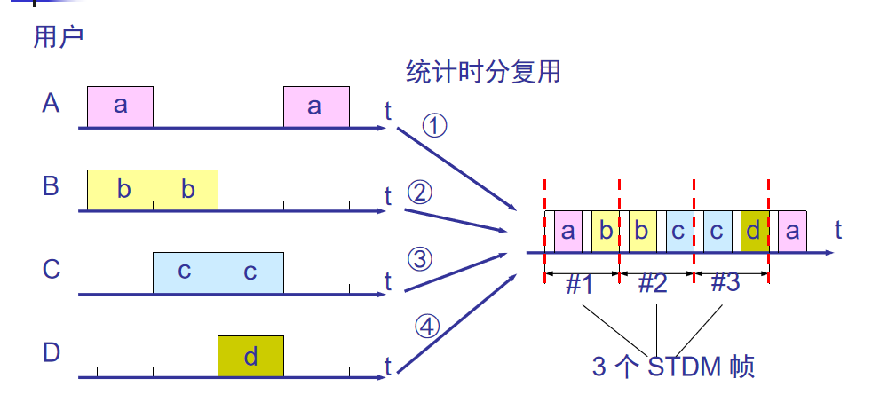
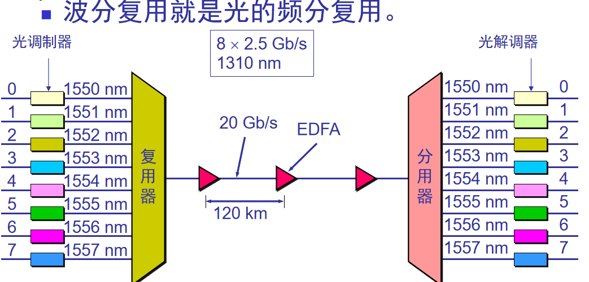

复用：当网络中传输的容量大与单一信道传输的总通信量时，可利用复用技术在一条物理线路上建立多条通信信道。

### 频繁复用、时分复用、统计时分复用

---------------------
频繁复用：  
频分复用的所有用户在同样的时间占用不同的带宽资源（请注意，这里的“带宽”是频率带宽而不是数据的发送速率）
缺点：随着用户数的增多，在的带宽需要增加。

时分复用：  
时分复用则是将时间划分为一段段等长的时分复用帧（TDM 帧）。每一个时分复用的用户在每一个 TDM 帧中占用固定序号的时隙。  
缺点：使用时分复用系统传送计算机数据时，由于计算机数据的突发性质，用户对分配到的子信道的利用率一般是不高的。 

统计时分复用： 
又称异步时分复用，而普通的时分复用称为同步时分复用。

### 波分复用

---------------------
波分复用：  
由于光载波的频率很高，因此习惯上用波长而不用频率来表示所使用的光载波。

### 码分复用

---------------------
常用的名词是码分多址 CDMA （Code Division Multiple Access)。  
各用户使用经过特殊挑选的不同码型，因此彼此不会造成干扰。  
这种系统发送的信号有很强的抗干扰能力，其频谱类似于白噪声，不易被敌人发现。  
每一个比特时间划分为 m 个短的间隔，称为码片(chip)。8bit码片意思是把一个比特时间划分为8个短的间隔。

每个站被指派一个唯一的 m bit 码片序列。如发送比特 1，则发送自己的 m bit 码片序列。如发送比特 0，则发送该码片序列的二进制反码。   
例如，S 站的 8 bit 码片序列是 00011011。  
发送比特 1 时，就发送序列 00011011，发送比特 0 时，就发送序列 11100100。  
为了方便，把1写完+1，0写为-1  
S 站的码片序列：(–1 –1 –1 +1 +1 –1 +1 +1)     

CDMA的重要特点：每个站分配的码片序列不仅必须各不相同，并且还必须互相正交(orthogonal)。在实用的系统中是使用伪随机码序列。  

码片序列的正交关系：令向量 S 表示站 S 的码片向量，令 T 表示其他任何站的码片向量。  
两个不同站的码片序列正交，就是向量 S 和T 的规格化内积(inner product)都是 0  
如：向量S(-1 -1 -1 +1 +1 -1 +1 +1),T向量为（-1 -1 +1 -1 +1 +1 +1 -1），  
带入正交公式（规格化内积）即（-1*-1）+（-1*-1）+（-1*+1）+（+1*-1）+（+1*+1）+（-1*+1）+（+1*+1）+（+1*-1）=0  
任何一个码片向量和该码片向量自己的规格化内积都是1。   
一个码片向量和该码片反码的向量的规格化内积值是 –1。  

当接受站打算收S站发送的信号时，就用S站的码片序列和受到的信号求规格化内积。这相当于分别计算S·Sx和S·Tx，然后再求他们的和。显然后者是零，而前者就是S站
发送的数据比特。  
