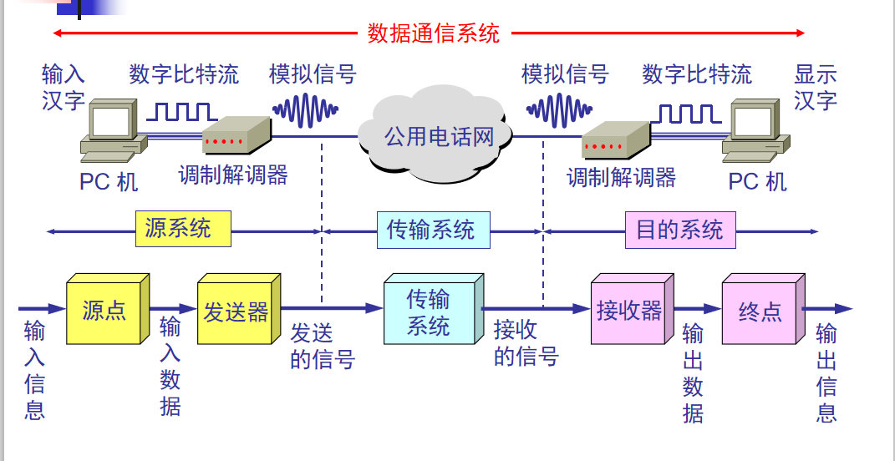
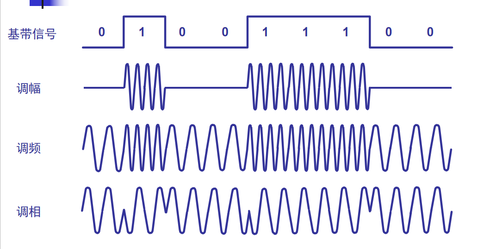
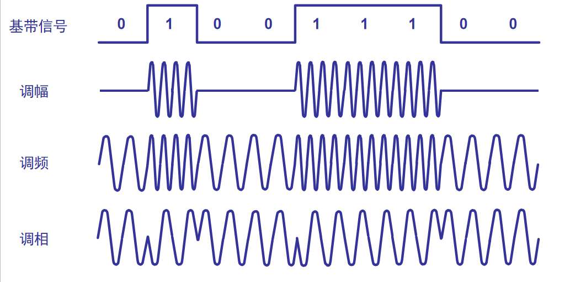
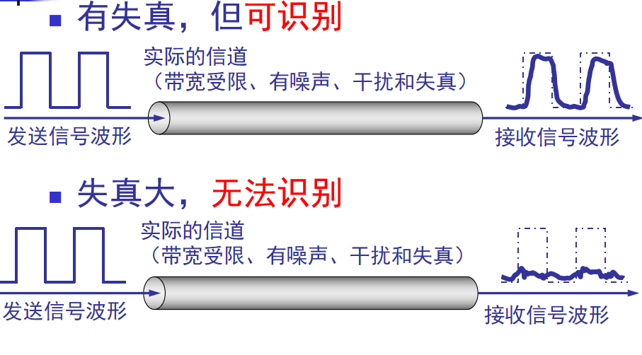
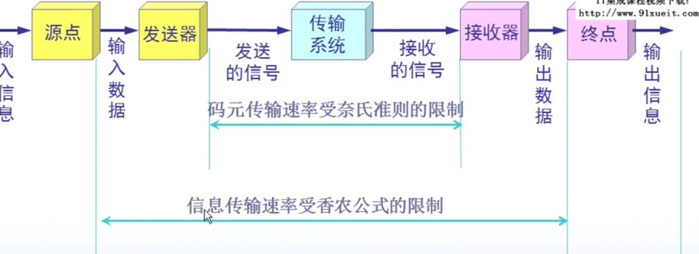

### 数据通信系统的模型

----------------------


源系统分为下面两部分：  
源点：原点设备产生要传输的数据，如键盘输入的字。  
发送器：通过源点生成的数字比特流通过发送器编码后才能够在传输系统中进行传输。

目的系统分为一下两部分：  
接收器：接收传输系统传送过来的信号，并把它转换为能够被目的设备处理的信息。  
终点：终点设备从接收器获取传送来的数字比特流，然后进行信息输出。

通信的目的是传送消息。  
消息：话音、文字、图像等  
数据：运送消息的实体。如一个人的信息表，数据就是这个信息表中的一个字段  
信号：数据的电气或电磁表现。  
模拟信号：连续信号——消息的参数的取值是连续的。  
数字信号：离散信号——消息的参数的取值的离散的。  
码元：在使用时间域的波形表示数字信号时，代表不同离散数值的基本波形。  
信道：信道表示向莫一方向传送消息的媒体。一条通信线路包含发送信道和接受信道。

### 编码与调制

----------------------
（1）常用编码方式  
编码：数字数据转为数字信号。  
调制：数字数据转为模拟信号。



曼彻斯特编码：中心上跳为0，下调为1  
差分曼彻斯特编码：中心处始终有跳动，开始边有跳为0，没跳为1

（2）基本的调制方法  
基带信号：包含多的低频成分，包括直流成分。
基带传输：在数字信道上直接传输基带信号的方法。  
```
许多模拟信道仅能通过某一频率范围的信号，无法直接传输基带信号，因此需要进行调制为模拟信号。
```
载波：对基带信号的频率范围搬到较高的频段进行传输。  
带通信号：通过载波调制后的信号。



### 信道的极限容量

----------------------

码元：时间间隔相同的符号来表示一个二进制数字，这样的时间间隔内的信号称为(二进制）码元。  
码元传输速率：单位时间内通过信道的码元数。  
```
我们希望在一定时间内传输尽可能多的码元，但是，码元传输速率越高，信号传输的距离越远，噪音越大，失真越严重
```

码间串扰：接收端受到的信号波形失去了码元之间的清晰界限。
柰氏准则：他给出了在假定的理想条件下，为了避免码间串扰，码元的传输速率的上限值。  
```
理想低通信道的最高码元传输速率=2WBaud（低通信道：信号的所有低频分量，其频率不超过某个上限则不失真通过此信道，高于该频率则无法通过）
理想带通信道的最高码元传输速率=WBuad（带通信道：在下限频率与上限频率之间则不失真，否则无法通过）
```
W是信道带宽，单位为赫（Hz）；Baud为波特，是码元传输速率的单位，1波特为每秒传送1个码元。

通过柰氏准则可知：码元传输的速率有上限，超出上线则有严重码间串扰。信道的带宽也大，则码间串扰就更小。

香农公式：信道的带宽或信道中的信噪比越大，则信息的极限传输速率就越高。C=Wlog下小2上（1+S/N） bit/s  
W为信道带宽（Hz），S为信道内所传信号的平均功率，N为信道内部的高斯噪声功率。



### 传输方式

----------------------
并行传输：一次发送n个比特  
串行传输：一个一个比特发送  
优缺点：并行快，成本高，适合短距离传送；

异步传输：以字节为独立的传输单位，字节之间的时间间隔不是固定的，通常每个字节前后都有起始位和结束位。  
同步传输：双方的时钟保持同步。

单向通道（单工）：无线电广播，没有反向回应  
双向交替通信（半双工）：对讲机，无法同时发送，但两边都可以发送
双向同时通信：电话，同时发送
