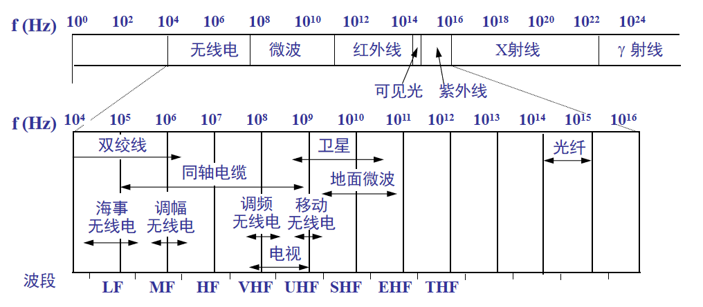
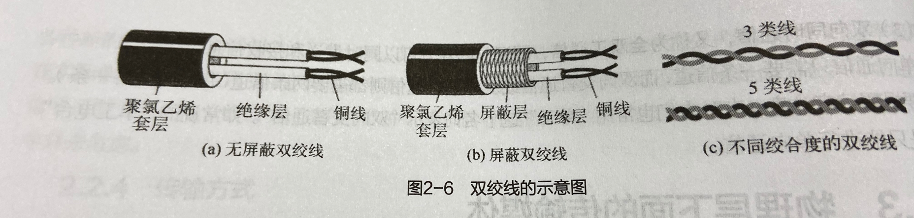
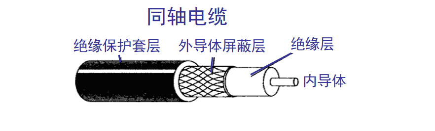
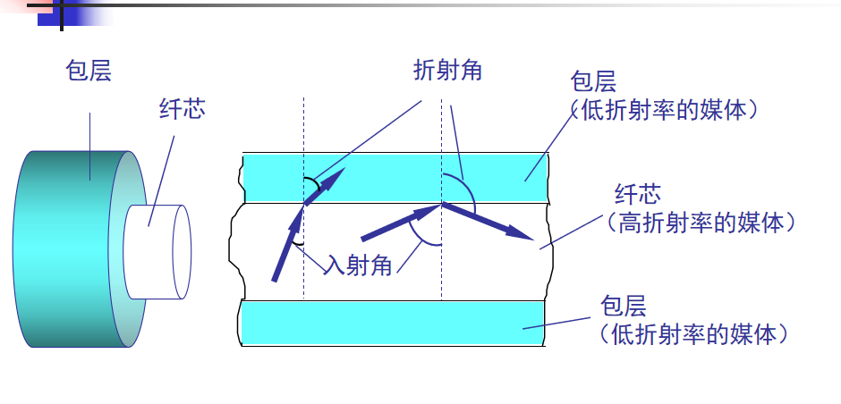
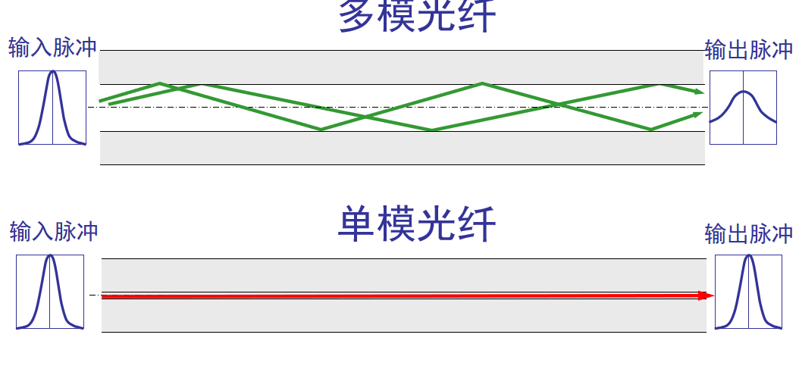

### 导引型传输媒体（沿着固体媒体传播）

双绞线：  
模拟传输和数字传输均可使用双绞线，距离一般几千米到十几千米。距离过大需要加放大器把信号放大（对于模拟信号）。（对于数字传输）需要加上中继器减小失真。  
绞合构成双绞线的作用是减小相连导线的电磁干扰。  

同轴电缆：  
屏蔽性比双绞线高，价格贵布线不灵活不方便，被光纤取代。

光纤：  
传输损耗小，在远距离传输更经济。  
抗雷电和电磁干扰性能好。  
无串扰，保密性好。  
体积小，重量轻。

### 非导引型传输媒体（电磁波传输，无线传输）

无线传输所使用的频段很广。  
短波通信主要是靠电离层的反射，但短波信道的通信质量较差。  
微波在空间主要是直线传播。（地面微波接力通信、卫星通信）  
