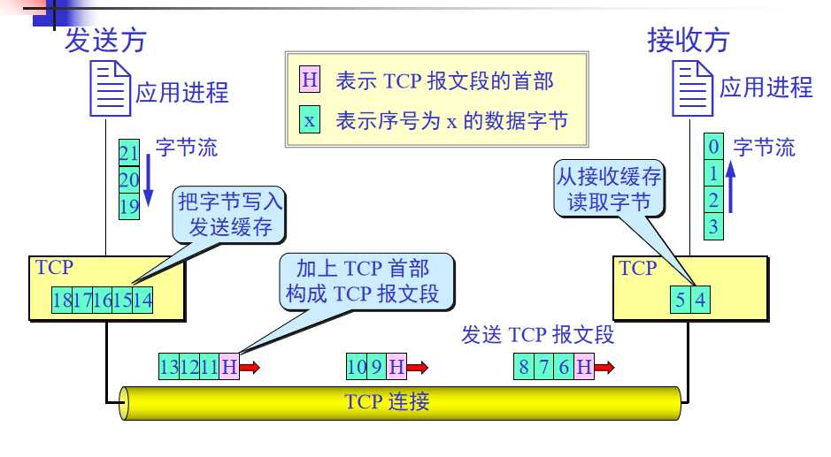

### TCP的主要特点

-----------------
特点：
（1）TCP是面向连接的运输层协议。即通信双方建立TCP连接，为接下来的数据传送做好准备，初始化各种状态变量，分配缓存等资源。完成传送后，需要释放连接。  
（2）每一条TCP连接只能有两个端点，即只能点对点（一对一）。一条TCP连接由两个套接字地址标识（IP地址、端口号）。  
（3）TCP提供可靠交付的服务。即TCP连接传送的数据无差错、不丢失、不重复，并且按序到达。  
（4）TCP提供全双工通信。TCP连接的两端设有发送缓存和接收缓存，用于临时存放双向通信的数据。  
（5）面向字节流。TCP中的**流**指的是流入到进程或从进程流出的字节序列。TCP的交互是一次一个数据块（大小不一），但TCP把从应用程序脚下来的数据看成  
一连串的无结构字节流。TCP不保证接收方所收到的数据块和发送方应用程序所发出的数据块具有对应大小的关系。虽然大小不一定相同，但字节流完全一样。  

过程：
（1）发送方的应用进程按照自己产生数据的规律(数据块长短不一)陆续写入TCP缓存。  
（2）TCP从缓存中取出一定数量的数据，组成TCP报文段逐个传送到IP层，然后发送出去。  
（3）接收方从IP层收到TCP报文后，暂存在缓存中，等待接收方的应用进程从接收缓存中按数据顺序读取。  

```
注意：
接收方应用进程不是一次读取接收缓存中一个完整的报文和所有数据，是按照应用进程指定的数量读取数据。
只有接收缓存中的数据量小于指定读取量，才返回缓存中所有数据。  
如果缓存中没有数据，应用进程可能一直等待，也可能直接返回。
```



TCP连接是一条虚连接，非物理连接，是抽象的逻辑连接。  
TCP连接仅存在两个端系统，而中间设备（路由器、交换机等）不知道该连接的存在。  
与UDP端口队列不同的是，TCP的发送缓存和接收缓存都是分配给一个连接的，而不是一个端口。TCP一个连接由四元组（源IP地址、源端口号、目的IP地址、目的端口）
标识。  
不同源TCP报文段、即使目的IP地址和目的端口号相同，它们在不同的TCP“管道”中传输，到达不同出口的缓存。  
