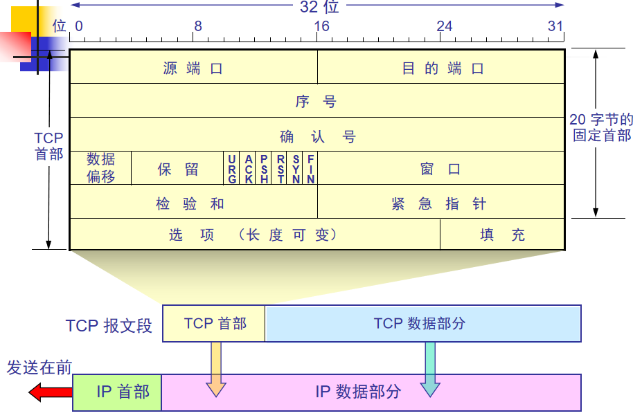
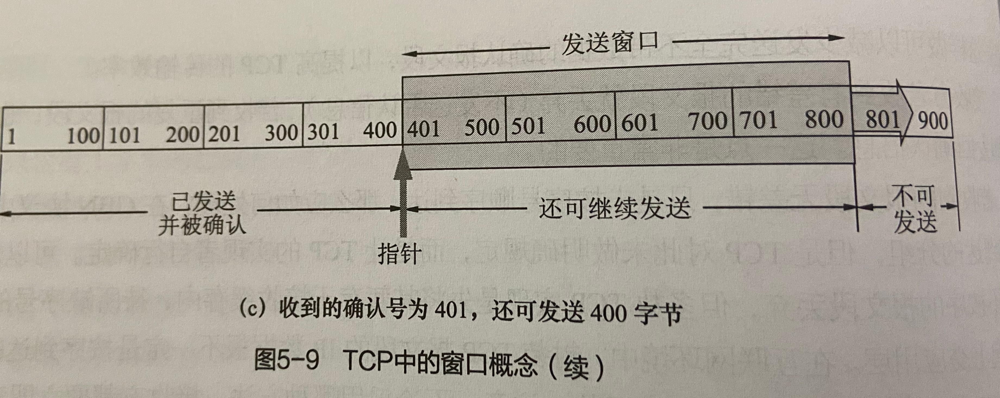

### TCP的主要特点

-----------------
特点：  
（1）TCP是面向连接的运输层协议。即通信双方建立TCP连接，为接下来的数据传送做好准备，初始化各种状态变量，分配缓存等资源。完成传送后，需要释放连接。  
（2）每一条TCP连接只能有两个端点，即只能点对点（一对一）。一条TCP连接由两个套接字地址标识（IP地址、端口号）。  
（3）TCP提供可靠交付的服务。即TCP连接传送的数据无差错、不丢失、不重复，并且按序到达。  
（4）TCP提供全双工通信。TCP连接的两端设有发送缓存和接收缓存，用于临时存放双向通信的数据。  
（5）面向字节流。TCP中的**流**指的是流入到进程或从进程流出的字节序列。TCP的交互是一次一个数据块（大小不一），但TCP把从应用程序脚下来的数据看成  
一连串的无结构字节流。TCP不保证接收方所收到的数据块和发送方应用程序所发出的数据块具有对应大小的关系。虽然大小不一定相同，但字节流完全一样。  

过程：  
（1）发送方的应用进程按照自己产生数据的规律(数据块长短不一)陆续写入TCP缓存。  
（2）TCP从缓存中取出一定数量的数据，组成TCP报文段逐个传送到IP层，然后发送出去。  
（3）接收方从IP层收到TCP报文后，暂存在缓存中，等待接收方的应用进程从接收缓存中按数据顺序读取。  

```
注意：  
接收方应用进程不是一次读取接收缓存中一个完整的报文和所有数据，是按照应用进程指定的数量读取数据。
只有接收缓存中的数据量小于指定读取量，才返回缓存中所有数据。  
如果缓存中没有数据，应用进程可能一直等待，也可能直接返回。
```


TCP连接是一条虚连接，非物理连接，是抽象的逻辑连接。  
TCP连接仅存在两个端系统，而中间设备（路由器、交换机等）不知道该连接的存在。  
与UDP端口队列不同的是，TCP的发送缓存和接收缓存都是分配给一个连接的，而不是一个端口。TCP一个连接由四元组（源IP地址、源端口号、目的IP地址、目的端口）
标识。  
不同源TCP报文段、即使目的IP地址和目的端口号相同，它们在不同的TCP“管道”中传输，到达不同出口的缓存。  

### TCP报文段的格式 

------------------



TCP虽然是面先字节流的，但TCP传送的数据单元却是报文段。  
TCP报文首部前20个字节是固定的，后面有4N个字节根据需要添加（N为整数）。  
首部各字段意义：  
（1）源端口和目的端口：各占2字节，该字段定义了主机发送和接收该报文段的应用程序的端口号，用于运输层的复用和分用。  
（2）序号：占4字节，序号从0开始，到2的32次幂-1为止，共2的32次幂个需要（4294967296）。值本报文段所发送的数据的第一个字节的序号。  
例：一段报文序号  字段值为301，携带的数据共100字节，表明：本报文段的第一个字节序号为301，最后一个序号为400，下一段报文从401开始。  
（3）确认号：占4字节，指期望收到对方的下一个报文段的第一个数据字节的序号。   
例：B收到A发来的一端报文段，序号为501，数据长度为200，这数据为501-700。因此，下一次B期望A发送的数据报序号是701，所有确认号位701。  
（4）数据偏移：占4位，指数据部分在TCP报文段的位置（即TCP报文首部的长度。），因为存在可选项，长度不固定，所以这个字段是必须的。  
因为4位二进制最大值为15（1111），因此数据偏移的最大值为60字节（宽为4个字节，15乘4=60）。  
（5）保留：占6位，保留为今后使用，目前为0。  
（6）紧急URG：当URG=1时，表明紧急指针字段有效。（高优先级的数据，不需要按序从接收缓存中读取）。  
（7）确认ACK：只有当ACK=1时确认号字段才有效。=0时，确认号无效。  
（8）推送PSH：发送方TCP把PSH置为1时，立即创建一个报文段发送出去，不需要积累足够多的数据再发送。  
接收方TCP收到PSH为1的报文段，尽快交付给接收应用进程，不需要等待足够多的数据才向上交付。  
应用程序可以选择推送操作，但现在多数TCP可以根据情况自动设置PSH。  
（9）复位RST：当RST=1时，表面TCP连接出现严重差错（主机奔溃等情况），释放连接，然后重写建立运输连接。还可以用来拒绝非法的报文段或连接。  
（10）同步SYN：用来建立连接。当SYN=1和ACK=0时，表明这是一个连接请求报文段。若对方同意，则应回复报文SYN=1和ACK=1。  
（11）终止FIN：释放一个连接，当FIN=1，表明该报文段的发送方数据已发送完毕，要求释放运输连接。  
（12）窗口：占2字节，窗口值指该报文段一方的接收窗口的大小，在0到2的16次幂-1之间。  
窗口用于控制对方发送的数据量（从确认号开始，允许对方发送的数据量）。计算机网络经常用接收方的接收能力来控制发送方的数据量。    
例：确认号为701，窗口字段为1000，则表明对方发送的数据范围为701-1700。  
（13）检验和：占2字节，检验范围为首部和数据。在计算检验和时，像UDP一样，加入12字节的伪首部，TCP协议为6。长度更改为TCP长度。  
（14）选项：长度可变，选项之一：最大报文段长度MMS=TCP报文段长度-TCP首部长度。MMS过长（需要在IP层分组）或过短（需要在IP层填充）都会增大开销。
默认MMS为536字节长，即报文段536+20=556长。  

### TCP的可靠传输

----------------
TCP中如何实现可靠传输的，并注意与GBN协议的不同：  
（1）数据编号与确认：  
1、TCP是面向字节的，TCP把应用层交下来的数据看作是一个个字节的数据流，并使每个字节对应一个序号。（GBN协议中是对每个分组进行编号）  
2、TCP采用的是累积确认，即确认对所有按序接收到的数据的确认。  
例：接收方已收到1-700号，801-1000号和1201-1500号，而701-800和1001-1200号每首到，则发送的确认序号应填入701  
3、TCP发送一段报文时，同时在自己的重传队列中存放这个报文段的一个副本。若收到确认，删除此副本。若在规定时间内没收到确认，则重传。  
4、TCP采用全双工通信，因此通信中每方都不需要专门发送确认报文段，而可以在传送数据时顺带把确认信息**捎带**传送。  
接收方在正确收到数据时可能等待一般不超过0.5s再发送确认。若这段时间内有数据发送给对方，这捎带确认。  
也可能这段时间又有多段数据达到，则可以对这多次的数据进行累积确认。  
5、接收方收到有差错的报文段就丢弃（不发送否认信息）。若收到重复报文段，丢弃，但要立即发回确认信息。  
6、若收到的报文段无差错，只是为按序号顺序到达，（GBN协议会把所有不按序的报文段丢弃）TCP会先暂存在接收缓存中，待所缺序号到齐一起交付应用层。  
7、TCP发送方每发送一个报文段，就会为这个报文段设置一个计时器。只要计时器设置的重传时间到了没收到确认就重传这段报文段。  
（某个报文段超时，GBN则发送窗口欸所有已发送的分组。）  

（2）以字节为单位的滑动窗口：  




1、为了提高报文段的传输效率，TCP采用滑动窗口协议。（GBN是发送的单位是分组数）TCP发送窗口大小的单位是字节。  
2、发送窗口的大小是从建立连接时在TCP可选报文中填写的数据，这个值会随接收方的接收能力决定。  
3、已发送并确认的字节会发送到应用程序并从发送缓存中删除。  
如果TCP发送方速度过快，最终会导致发送缓存被填满，这时发送应用程序必须等待，直到发送缓存可以再次工作。  
4、接收方收到的分组有差错则丢弃，如果接收方缓存被填满则把窗口减少到0.如果应用程序能即使读取缓存中数据，窗口则增大，但不能超过缓存大小。  

（3）超时重传时间的选择：  


