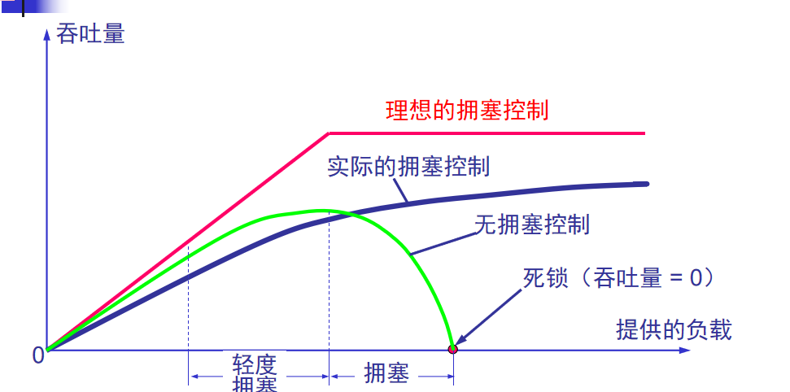

所谓拥塞控制就是防止过多的数据注入到网络中，这样可以使网络中的路由器或链路不致过载。  

### 拥塞的原因与危害

-------------------
横坐标：输入负载或网络负载，代表单位时间内输入给网络的分组数目。  
纵坐标：吞吐量，代表单位时间内从网络输出的数据量。  

为什么输入负载到达某一数值时，网络的吞吐量反而随输入负载的增大而下降呢？  
答：  
因为路由器排队的数据过多，超出了一定的量就会把多的分组丢弃，这些分组不能到达目的地，白白占用了经过链路的带宽和资源。形成拥塞。  

### 拥塞控制的基本方法

----------------------
拥塞控制和流量控制之间的区别是，它们都需要控制源点的发送速率。  
拥塞控制是防止过多的数据注入到网络中，使网络能够承受现有的网络负载。  
流量控制是特定点对点通信的发送方和接收方之间流量控制，防止发送方过快，导致接收方来不及处理丢失数据。  

拥塞控制的两大类：
1、开环控制方法就是在设计网络时事先将有关发生拥塞的因素考虑周到，力求网络在工作时不产生拥塞。（当网络系统的流量特征准确规定、性能要求事先获取适用）  
2、闭环控制是基于反馈环路的概念。属于闭环控制的有以下几种措施：(不能准确描述或系统不提供资源预留时适用)
（1）监测网络系统以便检测到拥塞在何时、何处发生。  
（2）将拥塞发生的信息传送到可采取行动的地方。  
（3）调整网络系统的运行以解决出现的问题。  

由于因特网中不提供资源预留机制，而且流量的特性不能准确描述，所以因特网采用闭环控制方法。  
存在显式反馈算法和隐式反馈算法。  
显式反馈算法：  
ICMP源站抑制报文，当路由器被大量IP数据报淹没时，路由器会丢弃一些数据报，同时使用ICMP通告源主机。  
隐式反馈算法：  
源端通过对网络行为的观察（如分组丢失与往返时间）来推断网络是否发生拥塞，无需拥塞点提供显示反馈信息。TCP采用隐式反馈算法。  

### TCP的拥塞控制 

----------------

