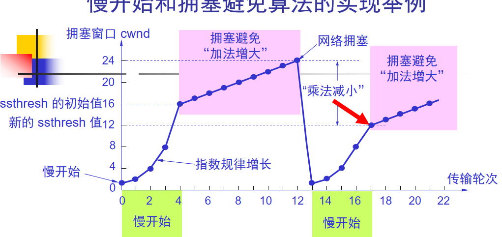
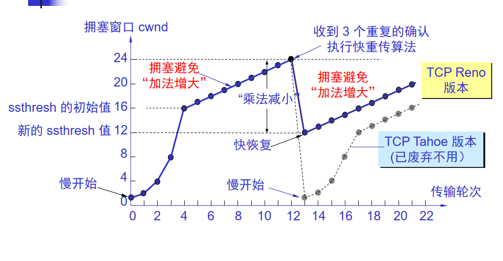

所谓拥塞控制就是防止过多的数据注入到网络中，这样可以使网络中的路由器或链路不致过载。  

### 拥塞的原因与危害

-------------------
横坐标：输入负载或网络负载，代表单位时间内输入给网络的分组数目。  
纵坐标：吞吐量，代表单位时间内从网络输出的数据量。  


为什么输入负载到达某一数值时，网络的吞吐量反而随输入负载的增大而下降呢？  
答：  
因为路由器排队的数据过多，超出了一定的量就会把多的分组丢弃，这些分组不能到达目的地，白白占用了经过链路的带宽和资源。形成拥塞。  

### 拥塞控制的基本方法

----------------------
拥塞控制和流量控制之间的区别是，它们都需要控制源点的发送速率。  
拥塞控制是防止过多的数据注入到网络中，使网络能够承受现有的网络负载。  
流量控制是特定点对点通信的发送方和接收方之间流量控制，防止发送方过快，导致接收方来不及处理丢失数据。  

拥塞控制的两大类：
1、开环控制方法就是在设计网络时事先将有关发生拥塞的因素考虑周到，力求网络在工作时不产生拥塞。（当网络系统的流量特征准确规定、性能要求事先获取适用）  
2、闭环控制是基于反馈环路的概念。属于闭环控制的有以下几种措施：(不能准确描述或系统不提供资源预留时适用)
（1）监测网络系统以便检测到拥塞在何时、何处发生。  
（2）将拥塞发生的信息传送到可采取行动的地方。  
（3）调整网络系统的运行以解决出现的问题。  

由于因特网中不提供资源预留机制，而且流量的特性不能准确描述，所以因特网采用闭环控制方法。  
存在显式反馈算法和隐式反馈算法。  
显式反馈算法：  
ICMP源站抑制报文，当路由器被大量IP数据报淹没时，路由器会丢弃一些数据报，同时使用ICMP通告源主机。  
隐式反馈算法：  
源端通过对网络行为的观察（如分组丢失与往返时间）来推断网络是否发生拥塞，无需拥塞点提供显示反馈信息。TCP采用隐式反馈算法。  

### TCP的拥塞控制 

----------------
1、TCP发送方如何限制其发送速率：  
TCP发送方在确定发送报文段的速率时，既要根据接收方的接受能力，又要从全局考虑不要使网络发生拥塞。  
除了接收窗口rwnd来限制发送窗口大小，还有TCP的发送方维持一个叫作cwnd拥塞窗口的状态变量。  
cwnd的大小取决于网络的拥塞程度，是动态变化的。  
TCP发送方窗口大小=Min（rwnd，cwnd）  

2、TCP发送方如何知道网络拥塞：  
发送方不一定要通过重传计时器超时才能发现分组丢失，还可以通过接收3个重复确认来判断有分组丢失。也认为是网络拥塞。因为线路传输问题概率极低。  

3、采用什么算法改变其发送速率：  
（1）慢启动  
（2）拥塞避免  
（3）快速恢复  

#### 慢启动和拥塞避免：  
假设rwnd足够大，发送窗口只受发送方的拥塞窗口的制约    
1、发送方先设置cwnd=1，发送第一个报文段M0，接收方接收到后确认M0。发送方收到M0的确认后，把cwnd设为2（发送方每收到一个新报文确认，拥塞窗口+1)。  
后面就是4，8，16直至**慢启动门限**   
“慢启动门限”是状态变量，即从慢启动阶段进入**拥塞避免**阶段的门限。  
```
慢开始门限 ssthresh 的用法如下：
当 cwnd < ssthresh 时，使用慢开始算法。
当 cwnd > ssthresh 时，停止使用慢开始算法而改用拥塞避免算法。
当 cwnd = ssthresh 时，既可使用慢开始算法，也可使用拥塞避免算法。
拥塞避免算法的思路是让拥塞窗口 cwnd 缓慢地增大，即每经过一个往返时间 RTT 就把发送方的拥塞窗口 cwnd 加 1，而不是加倍，使拥塞窗口 cwnd 按线性规律缓慢增长。
```

拥塞避免算法使发送方的拥塞窗口cwnd每经过一个往返时间RTT就增加一个MSS的大小。  
无论慢启动阶段还是在拥塞阶段，只要发送方发现网络出现拥塞（检测到分组丢失），就立即将cwnd重新设置为1，并执行慢启动。  
将慢启动门限ssthresh设置为出现拥塞时的发送窗口值（即接收方窗口和拥塞窗口中数值较小的一个）的一半（不能小于2）。  



```
必须强调指出 
“拥塞避免”并非指完全能够避免了拥塞。利用以上的措施要完全避免网络拥塞还是不可能的。
“拥塞避免”是说在拥塞避免阶段把拥塞窗口控制为按线性规律增长，使网络比较不容易出现拥塞。
```

#### 快速恢复：  
当发送端收到连续三个重复的确认时，就执行“乘法减小”算法，把慢开始门限 ssthresh 减半。但接下去不执行慢开始算法。
由于发送方现在认为网络很可能没有发生拥塞，因此现在不执行慢开始算法，即拥塞窗口 cwnd 现在不设置为 1，而是设置为慢开始门限 ssthresh 减半后的数值，然后开始执行拥塞避免算法（“加法增大”），使拥塞窗口缓慢地线性增大。  




