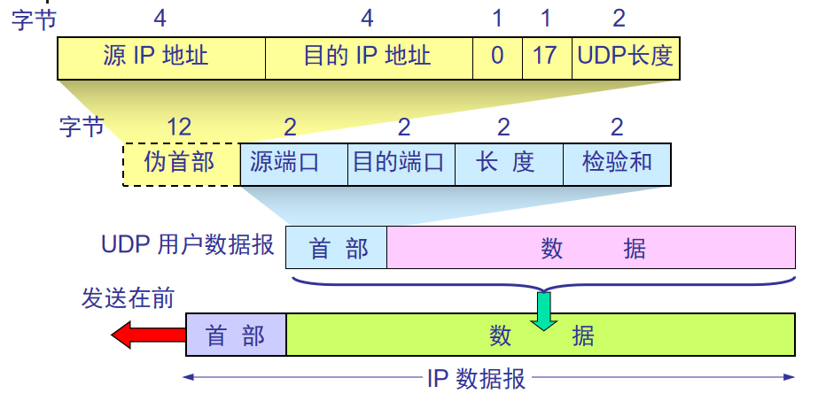

### UDP概述

----------
UDP优点：  
（1）UDP是无连接的，即发送数据之前不需要建立连接。  
（2）UDP使用尽最大努力交付、即不保证可靠交付，同时也不使用流量控制和拥塞控制。  
（3）由于UDP没有拥塞控制，因此网络出现的拥塞不会使源主机的发送速率降低。实时应用（如IP电话、实时视频会议等）要求源主机以恒定的速率发送数据，  
且允许网络发生拥塞时丢失一些数据，但不允许数据有太大时延。  
（4）UDP是面向报文的。UDP对应用程序交下来的报文不再划分。若报文太长，UDP把它交到IP层，IP层进行分组。  
（5）UDP支持一对一、一对多、多对一和多对多的交互通信。  
（6）用户数据报只有8个字节的首部，比TCP的20个字节首部短。  

### UDP报文的首部格式 

--------------------
UDP报文有两个字段：数据字段和首部字段。只有8个字节，由四个字段组成，每个字段2个字节。  
（1）源端口：源端口号  
（2）目的端口：目的端口号  
（3）长度：UDP用户数据报的长度  
（4）检验码：差错检验码，防止UDP用户数据报在传输中出错。  

UDP使用二元组（目的IP地址，目的端口号）来定位一个接收方的应用程序，而二元组（源IP地址，源端口号）来识别一个发送进程。  
如果报文到达的速度大与应用进程从队列中读取报文的速度，则导致队列（缓存）溢出和报文丢失。  
```
注意事项：
与TCP不同点，端口队列中的所有报文的目的IP地址和目的端口号相同，但源IP地址和源端口号并不一定相同。 
即不同源而同一目的的报文会定位到同一队列。
```



在计算UDP用户数据报之前增加12个字节的伪首部。这个**伪首部**不是UPD用户数据报真正的首部。只是在计算检验和时，临时和UDP用户数据报连接在一起，  
得到一个临时的UDP用户数据报。伪首部既不向下传送也不向上递交，仅为了计算检验和，防止报文交付到错误地址。  

UDP计算检验和和计算IP数据报首部检验不同相似，但不同点：IP数据报的检验和只检验首部，但UDP的检验和检测首部和数据。  


伪首部第三字段是全零。  
第四字节为IP首部中的协议字段值，UDP协议字段值为17。  
第五字段是UDP用户数据报的长度。  
