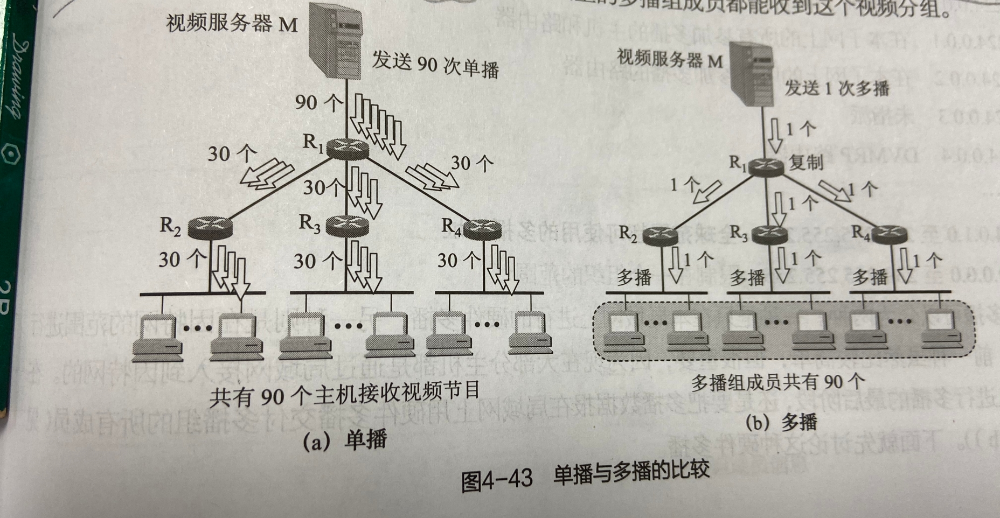
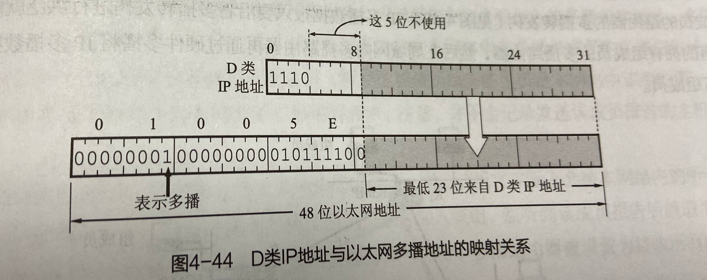

### IP多播的基本概念

---------------------
随着因特网用户数目的急剧增多，一个源点道道多个终点的需求越发需要。  
通过多播来减轻网络中各种资源的消耗。  
当分组到达目的局域网时，由于局域网具有硬件多播功能，因此不需要复制分组。  

因特网试验多播主干网，利用IP-in-IP隧道技术，将因特网的多播路由器互连成一个虚拟的支持多播的网络。  
这个多播数据报的目的地址不能写入这个主机的IP地址。在多播数据报的目的地址写入的是多播组的标识符，然后设法让加入到这个多播组的主机的IP地址与多播标识符  
关联起来。  
多播数据报和一般IP数据报的区别就是它使用D类IP地址作为目的地址。D类地址：224.0.0.0到239.255.255.255，总共2的28次幂个多播组
多播地址只能用于目的地址，不能用户源地址。  
多播数据报不产生ICMP差错报文。 
多播是使用UDP协议不可靠传输。  

IP多播可以分为两种：  
（1）硬件多播。  
（2）因特网范围进行的多播。  

### 在局域网上进行硬件多播  

---------------------------
因特网号码指派管理局IANA将以太网地址从01-00-5E-00-00-00到01-00-5E-7F-FF-FF的多播地址块用于映射IP多播的地址。  
D类IP地址块可供分配的有28位，前五位不嫩构成以太网硬件第hi，因此只有前23位。  
IP多播地址244.128.64.32（即E0-80-40-20）和另一个多播地址224.0.64.32（即E0-00-40-20）转换成以太网的硬件多播地址01-00-5E-00-40-20。  
由此可见，多播IP地址与以太网硬件的映射地址不是唯一的，因此收到多播数据报的主机还要在IP层利用软件进行过滤。  

### IP多播需要两种协议

-------------------
IGMP协议是让连接在本地局域网上的多播路由器知道本局域网上是否有主机（严格上讲是主机上某个进程）参加或退出了某个多播组。  
IGMP使用IP数据报传递报文（即IGMP报文加上IP首部构成IP数据报），也提供IP服务。  
IGMP不是一个单独的协议，属于整个网际协议IP的一个组成部分。  
IGMP不能完成多播任务，连接在局域网上的多播路由器必须和因特网上其他多播路由器协同工作，以便多播数据报用最小的代价传送给所有组成员。这需要**多播路由选择协议**

### 网际组管理协议IGMP

--------------------
IGMP有三种类型的报文与ICMP类似：  
（1）成员查询报文  
（2）成员报告报文  
（3）离开组报文  

IGMP报文也是封装在一个IP数据报中传输的，IP协议号为2。  
为了避免封装了IGMP报文的IP多播数据报被路由器转发到其他网络，IP数据报的TTL被设置为1。因此，IGMP仅在本网络中有效。  

### 多播路由选择协议  

-----------------------
（1）基于源树多播路由选择  
（2）共享树多播路由选择  
（3）因特网的多播路由选择协议
