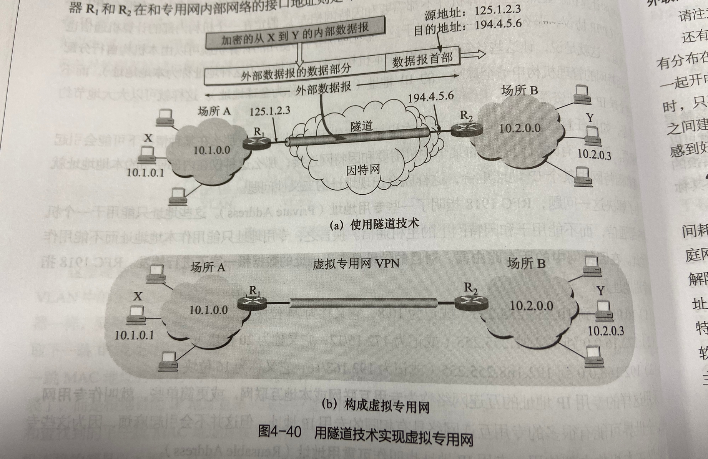
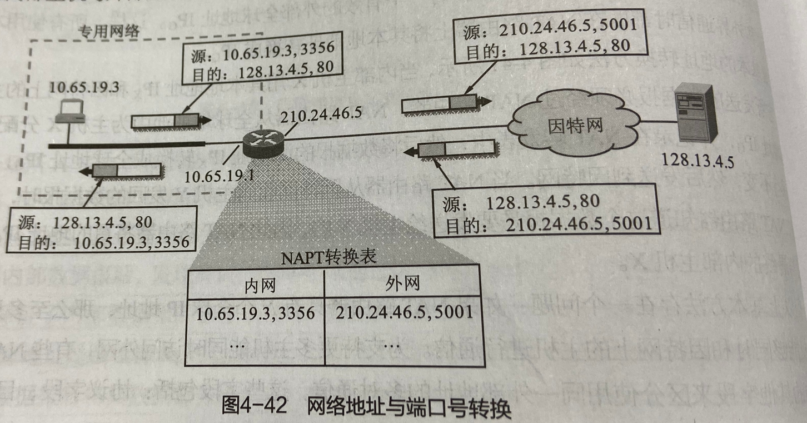

### 虚拟专用网VPN

-----------------
在因特网中的所有路由器，对目的地址是专用地址的数据报一律不进行转发。  
（1）10.0.0.0到10.255.255.255(或记为10/8，它又称为24位块)  
（2）172.16.0.0到172.31.255.255（或记为172.16/12，它又称为20位块）  
（3）192.168.0.0到192.168.255.255（或记为192.168/16，它又称为16位块）  

很多的机构有许多部门分布相距很远，而每个地点都有自己的专用网。如何使这些不同地点专用网进行通信？  
（1）租用电信公司的通信线路为本机构专用。好处方便简单，缺点租金太高。  
（2）利用公用的因特网作为本机构各专用网之间的通信载体。  

“虚拟”表示“好像是”，因为并没有专线而是通过公用的因特网来连接分散在各场所的本地网络。数据必须要加密。    

原理：  
IP数据报1层源地址10.1.0.1，目的地址10.2.0.3，两个专用网通过因特网发送到达。  
IP数据报2层源地址125.1.2.3，目的地址194.4.5.6，IP数据报1层加密，然后被IP数据报2层封装发送。  
这种技术被称为**IP-in-IP**  

远程接入VPN即员工在外，要访问一个专用网中的信息，在专用网中的PC装上VPN软件（TeamViewer之类的软件），员工通过账号密码就可以操控这台电脑，从而  
访问资源。相当于员工PC和公司主机建立了VPN隧道。  

### 网络地址转换NAT

------------------
NAT为了解决IP地址不够用的问题。  

网络地址与端口号转换（NAPT）也称为NAT：  
当NAPT路由器收到来自内网主机10.65.19.3源端口号3356的运输层分组时，NAPT路由器将内部地址和端口号转换为外部IP地址210.24.46.5和端口号也换了。  
由于端口号为16个比特。因此外部IP地址可支持60000多内部主机与外部主机通信。

