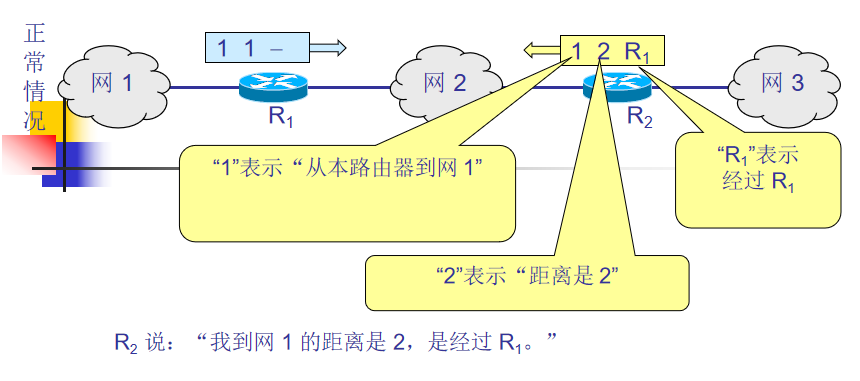
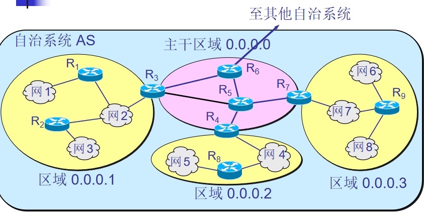
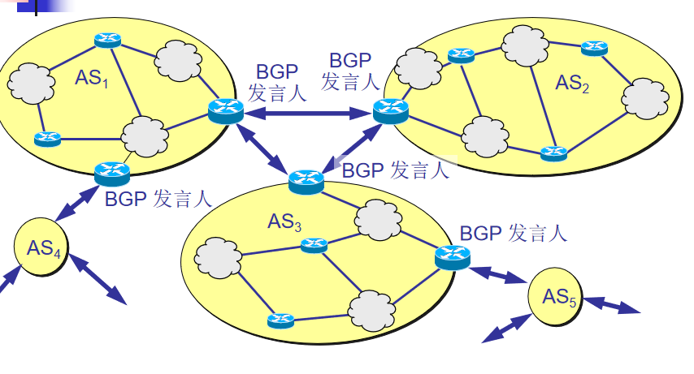

### 有关路由选择协议的几个基本概念

-------------------------------
1、理想的路由算法：
（1）算法必须是正确和完整的  
（2）算法在计算上应简单  
（3）算法应能适应通信量和网络拓扑的变化  
（4）算法应具有稳定性  
（5）算法应是公平的  
（6）算法应是最佳的  

通过调制网络的通信量或拓扑自适应变化划分路由算法可分为两类：  
静态路由选择策略：也叫非自适应路由选择，简单开销小，不能适应网络状态的变化。  
动态路由选择策略：也叫自适应路由选择，能较好适应网络状态变，实现复杂，开销较大。  

2、分层次的路由选择协议  
原因：  
（1）因特网的规模非常大，如果所有路由器知道所有网络怎么到达，开销非常大。  
（2）许多单位不愿意外界了解本部门的网络布局和路由选择协议等等。  
因此：  
因特网将整个互联网划分为许多个**自治系统**，记为AS。  
尽管一个AS使用多种内部路由选择协议和度量，但一个AS对于其他AS来说，是单一和一致的路由选择策略。  
AS内部网关协议（RIP和OSPF协议）  
AS之间网关协议（BGP）


### 内部网关协议RIP

------------------
RIP是一种分布式的基于距离向量的路由选择协议。  
RIP 协议要求网络中的每一个路由器都要维护从它自己到其他每一个目的网络的距离记录。  
RIP允许一条路径具有最多只能包含15个路由，因此距离等于16的不可到达。使用与小型互联网。  

```
RIP 协议的三个要点
仅和相邻路由器交换信息。 
交换的信息是当前本路由器所知道的全部信息，即自己的路由表。 
按固定的时间间隔交换路由信息，例如，每隔 30 秒。 
```

距离算法：  
路由器每隔大约30s向所有相邻路由器发送路由更新报文，并对每一个相邻路由器发送过来的路由器更新报文。  
步骤：  
（1）先修改路由X传来的RIP报文中的所有项目：把“下一跳”字段中的地址都改为 X，并把所有的“距离”字段的值加 1。即到目的网络N，距离d，下一跳路由为X  
（假设收到路由X传来的RIP报文中写，{NET2，3，Y}（即路由X到达N通过X的下一跳路由Y需要距离3），则我经过我的下一跳路由X到达N为{Net2，4，X}）
（2）对修改后的路由更新报文的每一个项目，进行以下步骤：  
1、若我的路由表中没有到达网络N的信息，则更新路由表新增{Net2，4，X}，否则查看目的网络N的表项的下一跳路由器地址。  
2、若下一跳路由器地址是X，则把{Net2，4，X}更新路由表，（不管原来路由表中项目为{Net2，3，X}还是{Net2，5，X}都要更新，以最新消息为准），  
否则（即目的地址N的下一跳不是X）
3、若收到的项目中距离小于d，则进行更新，否则不更新
（3）超过180s，则设置距离为16，若再过一段时间还是没收到则路由表删除该项目。  
（4）若路由表没发生变化，向所有相邻路由器发送路由更新报文。  
（5）返回。  

RIP协议让互联网中的所有路由器都和自己的相邻路由器不断交换路由信息，并不断更新其路由表，使得从每一个路由器到每一个目的网络的路由都是最短的（即跳数最少）。

虽然所有的路由器最终都拥有了整个自治系统的全局路由信息，但由于每一个路由器的位置不同，它们的路由表当然也应当是不同的。  

RIP坏消息传播得慢：  




不断循环，知道距离到达16。  

### 内部网关协议OSPF

----------------------
OSPF开放最短路径优先，它只是一个协议的名字，并不表示其他的路由选择协议不是“最短路径优先”。使用分布式的链路状态。  
```
三个要点 
向本自治系统中所有路由器发送信息，这里使用的方法是洪泛法。
发送的信息就是与本路由器相邻的所有路由器的链路状态，但这只是路由器所知道的部分信息。
“链路状态”就是说明本路由器都和哪些路由器相邻，以及该链路的“度量”(metric)。“度量”表示费用、距离、时延、带宽等。
只有当链路状态发生变化时，路由器才用洪泛法向所有路由器发送此信息。
```

由于每个路由器都要将自己所知的链路状态信息广播给其他路由器，因此所有的路由器最终建立了一个**链路状态数据库**，实际就是全网的拓扑结构图。  
为了使 OSPF 能够用于规模很大的网络，OSPF 将一个自治系统再划分为若干个更小的范围，叫作区域。  
每一个区域都有一个 32 位的区域标识符（用点分十进制表示）。  
区域也不能太大，在一个区域内的路由器最好不超过 200 个。    



R3、R4和R7都是区域边界路由器，R3、R4、R5、R6和R7为主干路由器，R6为自治系统边界路由器。  

OSPF 不用 UDP 而是直接用 IP 数据报传送。
OSPF 的其他特点：  
（1）OSPF对于不同类型的业务可计算出不同的路由。  
（2）如果到同一个目的网络有多条相同代价的路径，可以将流量分配给这几条路径，这叫做多路径间负载平衡。  
（3）所有在OSPF路由器之间交换的分组（如：链路状态更新分组）都具有鉴别的功能。  
（4）OSPF支持可变长子网掩码和无分类编址CIDR。  
（5）每一个链路状态都带上一个 32 位的序号，序号越大状态就越新。

OSPF 的五种分组类型：  
类型1，问候(Hello)分组。  
类型2，数据库描述(Database Description)分组。  
类型3，链路状态请求(Link State Request)分组。  
类型4，链路状态更新(Link State Update)分组，用洪泛法对全网更新链路状态。  
类型5，链路状态确认(Link State Acknowledgment)分组。   

### 外部网关协议BGP

---------------------
BGP 是不同自治系统的路由器之间交换路由信息的协议。  
在不同AS之间的路由选择为什么不能使用内部网关协议，如RIP或OSPF？  
因为：  
内部网关协议主要是设法使数据报在一个AS中尽可能有效地从源站传送到目的站。一个AS内部不需要考虑其他方面的策略。
（1）因特网的规模太大，使AS之间路由选择非常困难。  
（2）AS之间的路由选择必须考虑有有关策略。（如一些企业不允许从本网路通过）  

BGP协议的工作原理：  
一个BGP发言人与其他AS的BGP发言人要交换路由信息，要先建立TCP连接（端口号为179），然后在此连接上交换BGP报文以建立BGP会话，利用BGP会话交换路由信息。  
如下图：三个AS中的五个BGP发言人。每一个发言人除了运行BGP协议外，还要运行AS内部网关协议。  



BGP-4 共使用四种报文:  
(1) 打开(OPEN)报文，用来与相邻的另一个BGP发言人建立关系。
(2) 更新(UPDATE)报文，用来发送某一路由的信息，以及列出要撤消的多条路由。
(3) 保活(KEEPALIVE)报文，用来确认打开报文和周期性地证实邻站关系。
(4) 通知(NOTIFICATION)报文，用来发送检测到的差错。


