网络协议配套使用下面四个协议：  
（1）地址解析协议（ARP）  
（2）逆地址解析协议（RARP）  
（3）网际控制报文协议（ICMP）  
（4）网际组管理协议（IGMP）  

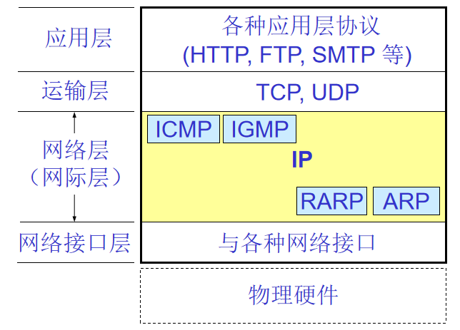

### 异构网络互连

----------------
能不能让大家都使用相同的网络，这样可使网络互连比较简单？  
答案：不能，因为用户需求是多样的，没有一种单一的网络能够适应所有用户的需求。  
网络互联使用以下四种不同中间设备：  
（1）物理层使用中间设备**转发器**（集线器）  
（2）数据链路层使用的中间设备**网桥或桥接器**（网桥和交换机）  
（3）网络层使用的中间设备叫做**路由器**  
（4）在网络层以上使用的中间设备叫做**网关**，用网关连接两个不兼容的系统在高层进行协议的转换。  

路由器是一台专用计算机，用来在互联网中进行路由选择。由于历史原因，许多有关TCP/IP的文献曾经把网络层使用的路由器称为网关。  

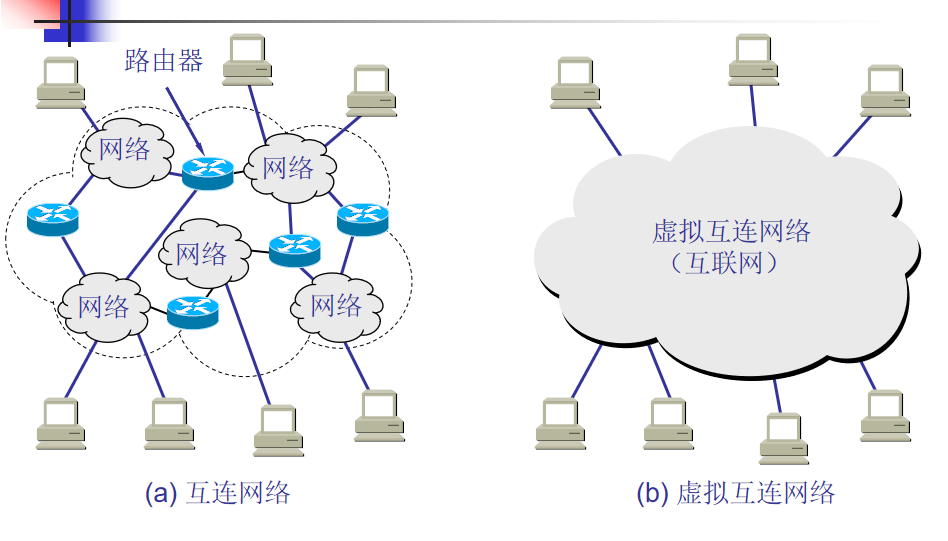

虚拟互连网络的意义：  
所谓虚拟互连网络也就是逻辑互连网络，它的意思就是互连起来的各种物理网络的异构性本来是客观存在的，  
但是我们利用 IP 协议就可以使这些性能各异的网络从用户看起来好像是一个统一的网络。  
使用 IP 协议的虚拟互连网络可简称为 IP 网。  
使用虚拟互连网络的好处是：当互联网上的主机进行通信时，就好像在一个网络上通信一样，而看不见互连的各具体的网络异构细节。  

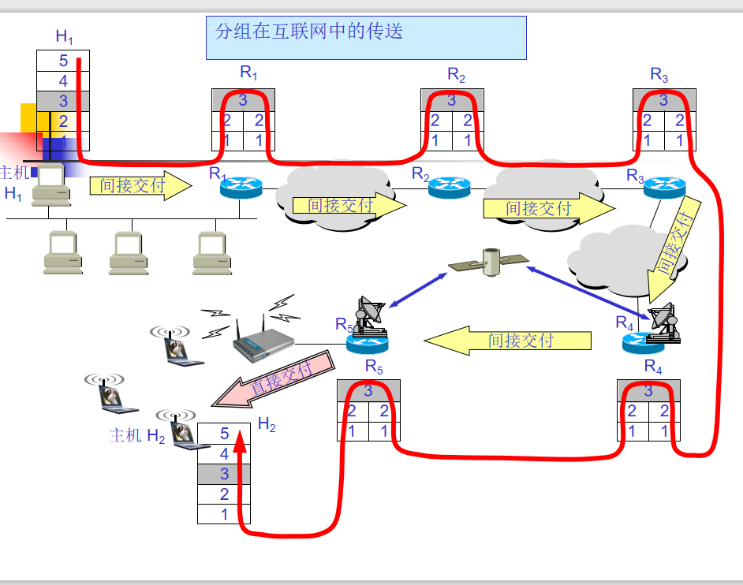

### IP地址及编制方式

---------------------
整个因特网就是一个单一的逻辑网络。IP地址就是因特网给每一台主机（或路由器）分配的全世界唯一的32位标识符。  
IP 地址的编址方法 ：  
（1）分类的 IP 地址。这是最基本的编址方法，在 1981 年就通过了相应的标准协议。IP 地址 ::= { <网络号>, <主机号>} 

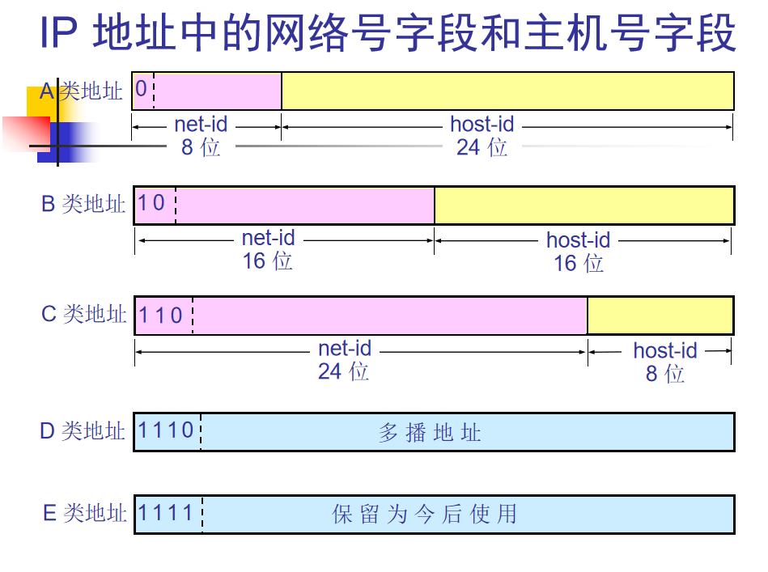

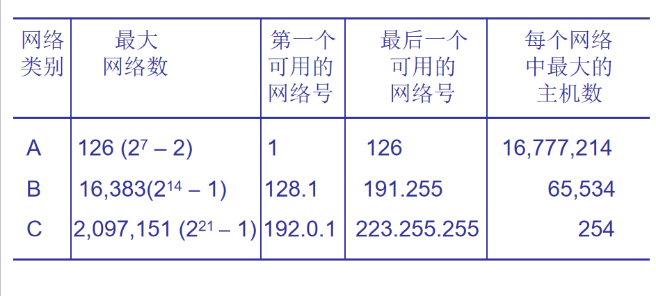

（2）子网的划分。这是对最基本的编址方法CIDR的改进，其标准[RFC 950]在 1985 年通过。IP 地址 ::= { <网络号>,<子网号>, <主机号>}   
（3）构成超网（CIDR）。这是比较新的无分类编址方法。1993 年提出后很快就得到推广应用。IP 地址 ::= { <网络号>, <主机号>}   
子网掩码作用是**划分子网**：  
A类地址默认子网掩码：255.0.0.0  
B类地址默认子网掩码：255.255.0.0  
C类地址默认子网掩码：255.255.255.0    

例题：已知IP地址为141.14.72.24，子网掩码为255.255.192.0，求网络地址：    
子网掩码11111111 11111111 11000000 00000000，  
IP地址为10001101 00001110 01001000 00011000，进行与运算  
得出结果10001101 00011110 01000000 00000000，即141.14.64.0    

在每个主机的网络连接属性中不仅要配置主机的IP地址，还要配置网络的子网掩码。  
CIDR还使用**斜线记法**，斜线后面的数字就是地址掩码中1的个数。/20表示掩码为11111111 11111111 11110000 00000000（255.255.240.0）  
各网络的子网掩码可以不同，即网络前缀的长度可以不同，因此各自的地址空间大小也不同。如LAN1，LAN3的地址空间为256，LAN2为512，N1、N2、N3为4

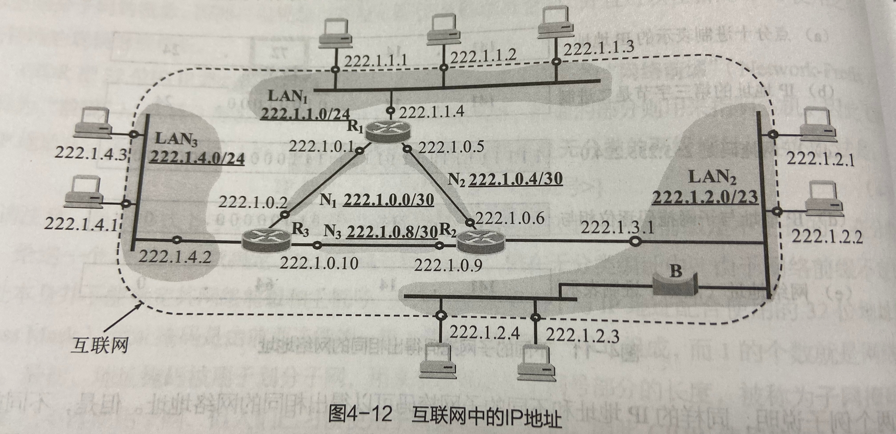

CIRD把网络前缀都相同的连续的IP地址组成**CIDR地址块**  
例子：已知IP地址：128.14.35.7/20，前20位为网络前缀，后12位为主机号，地址块为2的12次幂个地址。  
128.14.35.7/20 = 10000000 00001110 0010 0011 00000111   
最小地址：128.14.32.0 = 10000000 00001110 0010 0000 00000000  
最大地址：128.14.47.255 = 100000000 00001110 0010 1111 11111111  

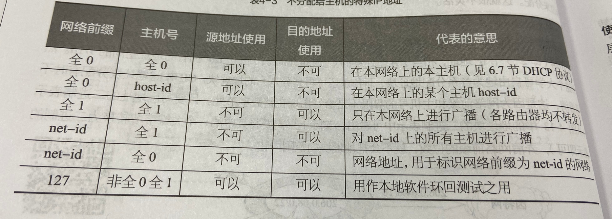

```
IP 地址的一些重要特点:
(1)  IP 地址是一种分等级的地址结构。分两个等级的好处是：  
第一，IP 地址管理机构在分配 IP 地址时只分配网络号，而剩下的主机号则由得到该网络号的单位自行分配。这样就方便了 IP 地址的管理。  
第二，路由器仅根据目的主机所连接的网络号来转发分组（而不考虑目的主机号），这样就可以使路由表中的项目数大幅度减少，从而减小了路由表所占的存储空间。  
(2)  实际上 IP 地址是标志一个主机（或路由器）和一条链路的接口。   
当一个主机同时连接到两个网络上时，该主机就必须同时具有两个相应的 IP 地址，其网络号 net-id 必须是不同的。这种主机称为多归属主机(multihomed host)。  
由于一个路由器至少应当连接到两个网络（这样它才能将 IP 数据报从一个网络转发到另一个网络），因此一个路由器至少应当有两个不同的 IP 地址。   
(3) 用转发器或网桥连接起来的若干个局域网仍为一个网络，因此这些局域网都具有同样的网络号 net-id。  
(4) 所有分配到网络号 net-id 的网络，范围很小的局域网，还是可能覆盖很大地理范围的广域网，都是平等的。  
```

### IP地址与物理地址

------------------
物理地址就是数据链路层和物理层使用的地址，而IP地址就是网络层和以上各层使用的地址，是一种逻辑地址。  
当IP数据报放入数据链路层的MAC帧中后，整个IP数据报就是MAC帧的数据，因此数据链路层看不到IP地址。  

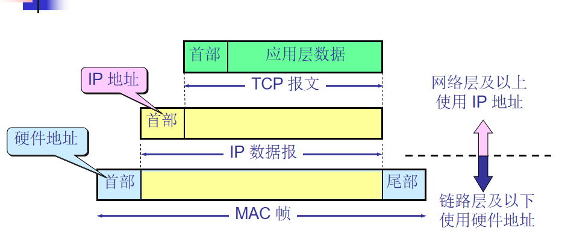

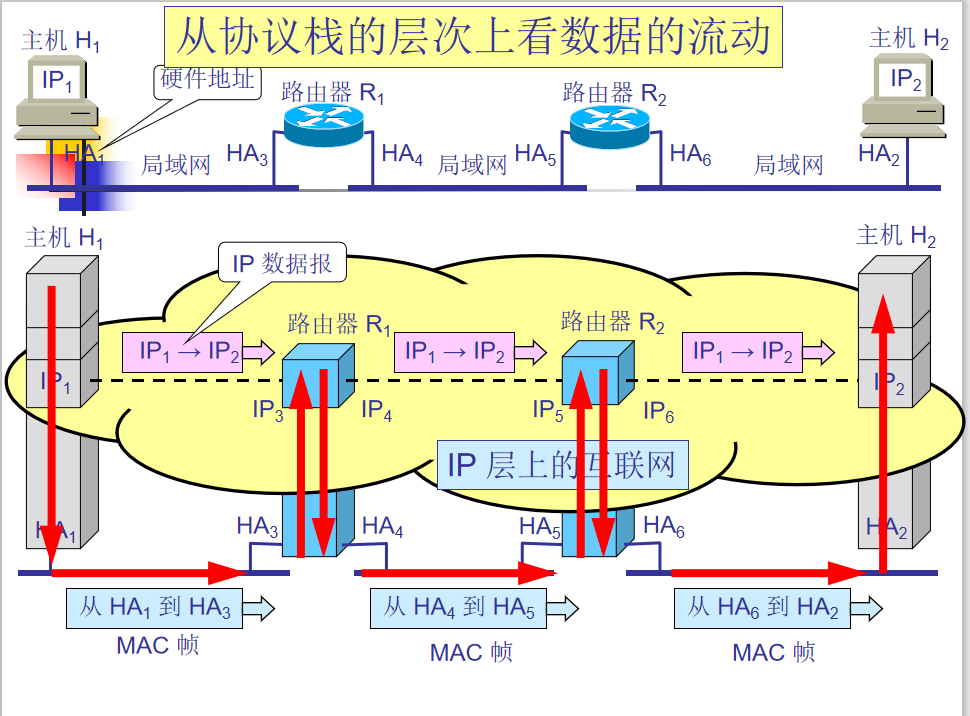

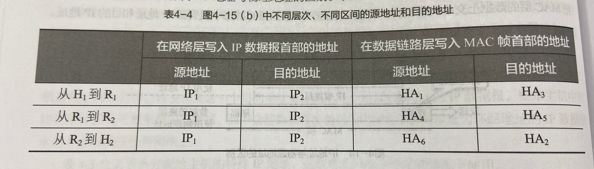

### 地址解析协议（ARP）

-----------------------
已知一个机器（主机或路由）的IP地址，需要找出它相应的MAC物理地址；或反过来则需要用到ARP和逆地址解析协议RAPR来解决问题。  
不管网络层使用的是什么协议，在实际网络的链路上传送数据帧时，最终还是必须使用硬件地址。  
每一个主机都设有一个 ARP 高速缓存(ARP cache)，里面有所在的局域网上的各主机和路由器的 IP 地址到硬件地址的映射表。  
当主机 A 欲向本局域网上的某个主机 B 发送 IP 数据报时，就先在其 ARP 高速缓存中查看有无主机 B 的 IP 地址。  
如有，就可查出其对应的硬件地址，再将此硬件地址写入 MAC 帧，然后通过局域网将该 MAC 帧发往此硬件地址。  

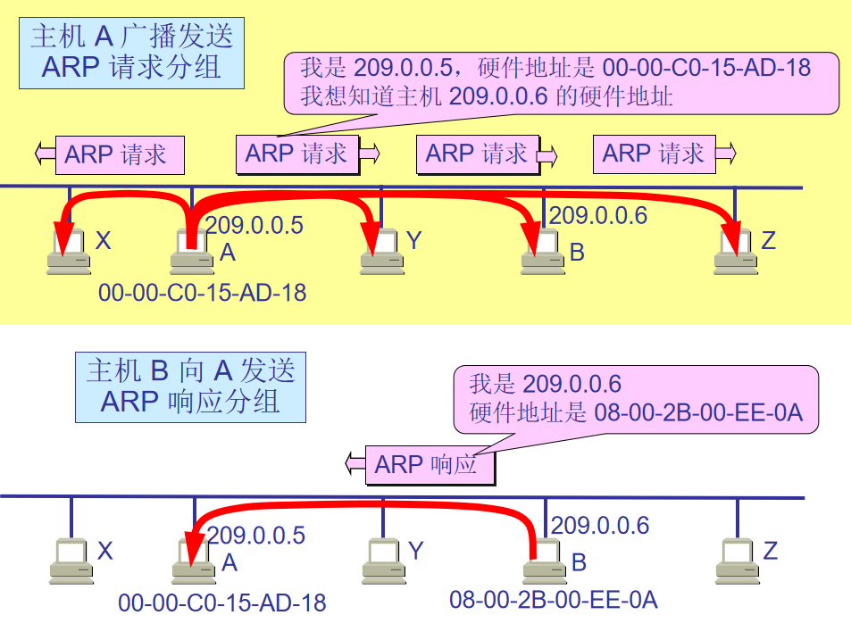

使用 ARP 的四种典型情况：  
发送方是主机，要把IP数据报发送到本网络上的另一个主机。这时用 ARP 找到目的主机的硬件地址。   
发送方是主机，要把 IP 数据报发送到另一个网络上的一个主机。这时用 ARP 找到本网络上的一个路由器的硬件地址。剩下的工作由这个路由器来完成。   
发送方是路由器，要把 IP 数据报转发到本网络上的一个主机。这时用 ARP 找到目的主机的硬件地址。   
发送方是路由器，要把 IP 数据报转发到另一个网络上的一个主机。这时用 ARP 找到本网络上的一个路由器的硬件地址。剩下的工作由这个路由器来完成。  

```
应当注意的问题
ARP 是解决同一个局域网上的主机或路由器的 IP 地址和硬件地址的映射问题。
如果所要找的主机和源主机不在同一个局域网上，那么就要通过 ARP 找到一个位于本局域网上的某个路由器的硬件地址，
然后把分组发送给这个路由器，让这个路由器把分组转发给下一个网络。剩下的工作就由下一个网络来做。
```

```
为什么不直接使用物理地址进行通信，而使用逻辑IP地址并调用ARP来寻找处相应的物理地址？
答案：存在各种各样的网络，使用不同的物理地址，要使这些异构网络能够互相通信就必须进行非常复杂的物理地址转换工作。  
用户或用户主机是不可能完成这个工作的。  
```

### IP数据报的格式

---------------------
一个 IP 数据报由首部和数据两部分组成。  
首部的前一部分是固定长度，共 20 字节，是所有 IP 数据报必须具有的。  
在首部的固定部分的后面是一些可选字段，其长度是可变的。   

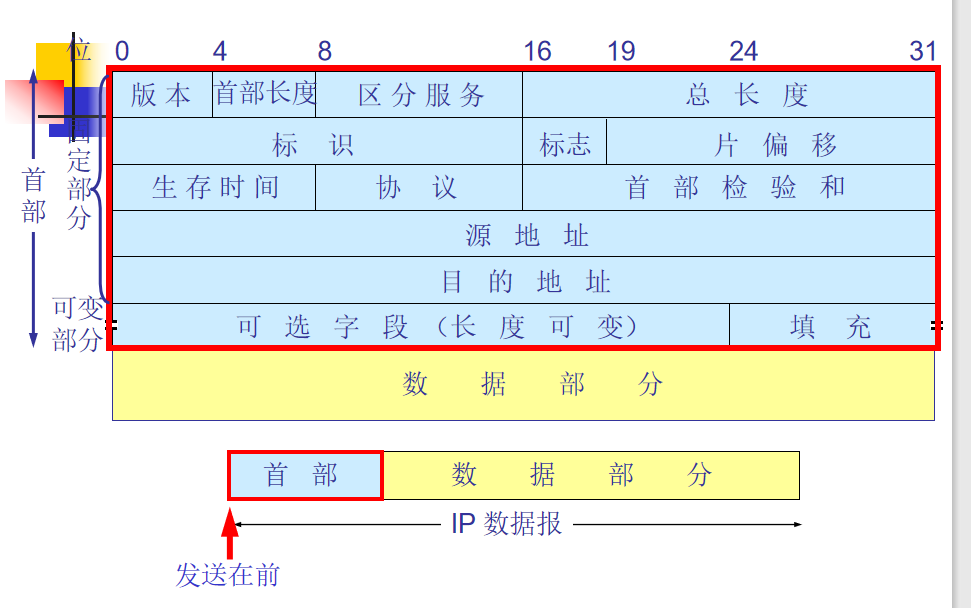

版本：占 4 位，指 IP 协议的版本目前的 IP 协议版本号为 4 (即 IPv4)  
首部长度：占 4 位，可表示的最大数值是 15 个单位(一个单位为 4 字节，宽为4个字节，长为15位，4乘15=60字节)因此 IP 的首部长度的最大值是 60 字节。   
区分服务：占 8 位，用来获得更好的服务在旧标准中叫做服务类型，但实际上一直未被使用过。  
总长度：占 16 位，指首部和数据之和的长度，单位为字节，因此数据报的最大长度为 65535 字节。总长度必须不超过最大传送单元 MTU。  
标识(identification)：占 16 位，它是一个计数器，用来产生数据报的标识。  
标志(flag)：占 3 位，目前只有前两位有意义。标志字段的最低位是 MF (More Fragment)。MF = 1 表示后面“还有分片”。MF = 0 表示最后一个分片。标志字段中间的一位是 DF (Don't Fragment) 。只有当 DF = 0 时才允许分片。  
片偏移(12 位)指出：较长的分组在分片后某片在原分组中的相对位置。片偏移以 8 个字节为偏移单位。   
生存时间(8 位)记为 TTL (Time To Live)：数据报在网络中可通过的路由器数的最大值。  
协议(8 位)字段：指出此数据报携带的数据使用何种协议以便目的主机的 IP 层将数据部分上交给哪个处理过程。  

|协议名|ICMP|IGMP|TCP|EGP|IGP|UDP|IPv6|OSPF|
|-----|-----|--|--|---|---|---|---|---|
|协议字段值|1|2|6|8|9|17|41|89|

首部检验和(16 位)字段：只检验数据报的首部不检验数据部分。这里不采用 CRC 检验码而采用简单的计算方法。  
源地址和目的地址：都各占 4 字节   
IP 数据报首部的可变部分：用来支持排错、测量以及安全等措施，内容很丰富，长度可变，从 1 个字节到 40 个字节不等。

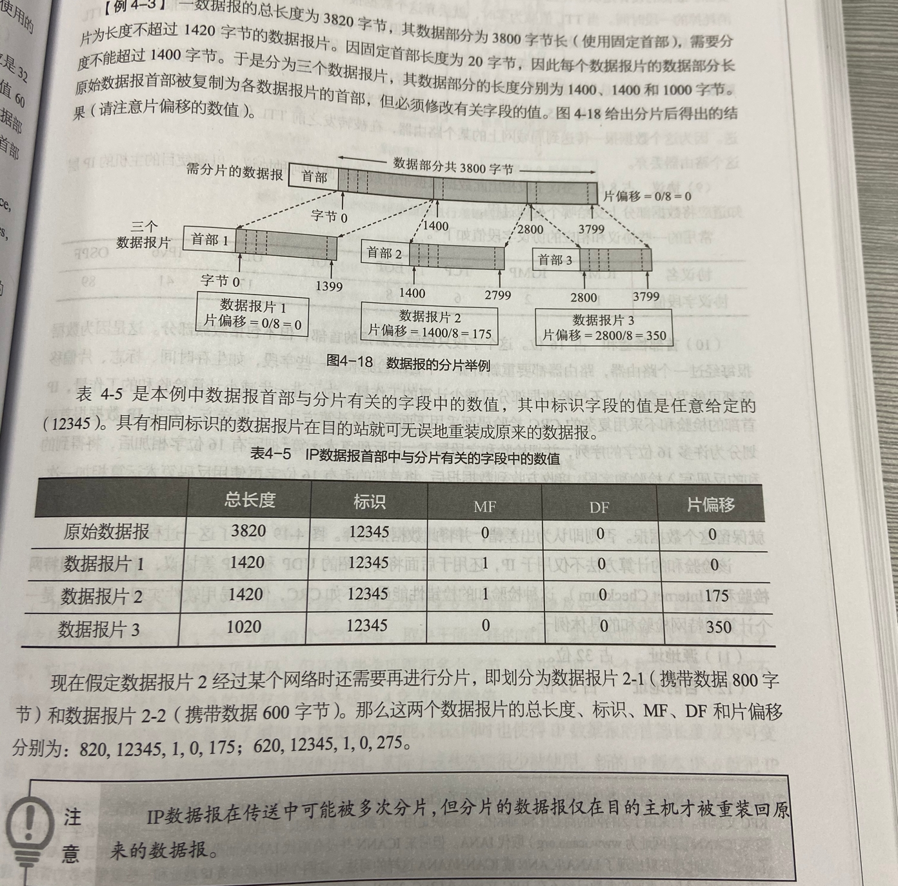

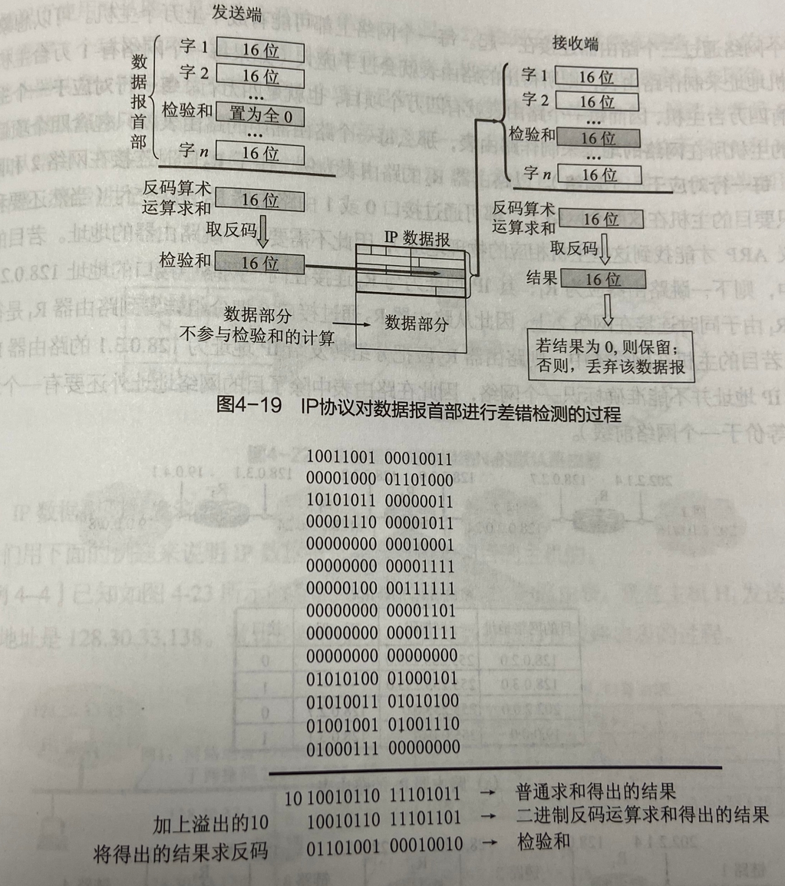

### IP数据报的转发

-------------------
有四个 A 类网络通过三个路由器连接在一起。每一个网络上都可能有成千上万个主机。  
可以想像，若按目的主机号来制作路由表，则所得出的路由表就会过于庞大。  
但若按主机所在的网络地址来制作路由表，那么每一个路由器中的路由表就只包含 4 个项目。这样就可使路由表大大简化  

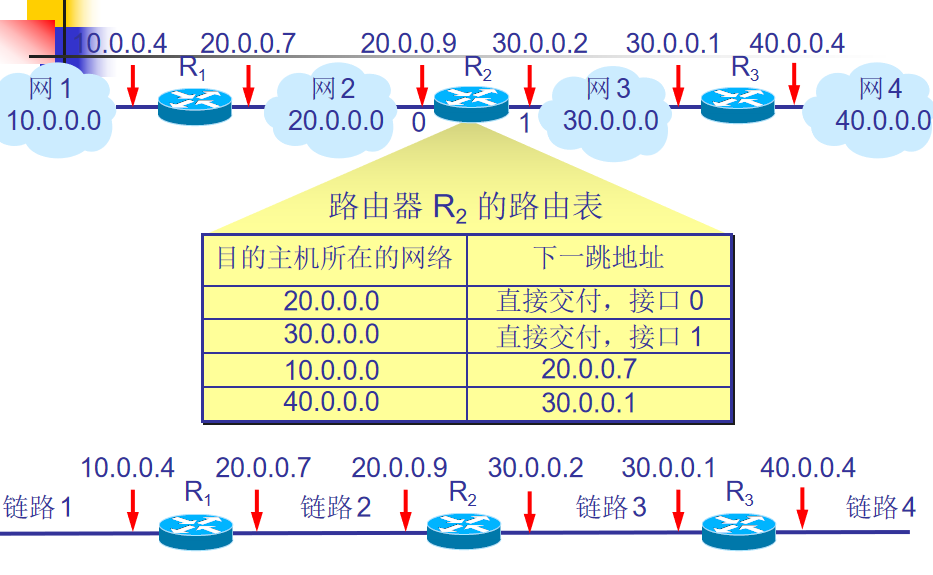

默认路由：只要目的网络不是 N1 和 N2，就一律选择默认路由，把数据报先间接交付路由器 R1，让 R1 再转发给下一个路由器。  
网关就是默认路由，如果一台计算机有两个或以上的网关，则会容易丢包，然后重发，浪费效率。  

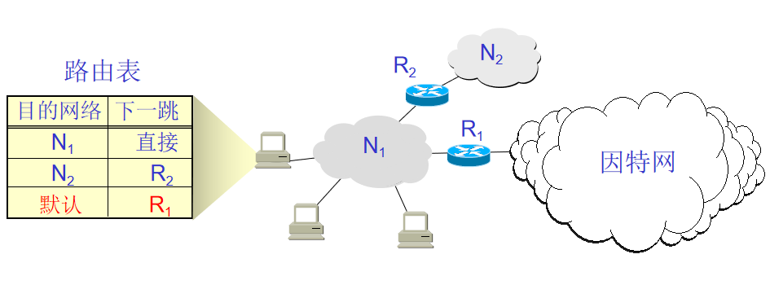

```
必须强调指出
IP 数据报的首部中没有地方可以用来指明“下一跳路由器的 IP 地址”。
当路由器收到待转发的数据报，不是将下一跳路由器的 IP 地址填入 IP 数据报，而是送交下层的网络接口软件。
网络接口软件使用 ARP 负责将下一跳路由器的 IP 地址转换成硬件地址，并将此硬件地址放在链路层的 MAC 帧的首部，然后根据这个硬件地址找到下一跳路由器。  
```

```
分组转发算法
(1)从数据报的首部提取目的主机的 IP 地址 D, 得出目的网络地址为 N。
(2)若网络 N 与此路由器直接相连，则把数据报直接交付目的主机 D；否则是间接交付，执行(3)。
(3)路由表中有目的地址为 D 的特定主机路由，则把数据报传送给路由表中所指明的下一跳路由器；否则，执行(4)。
(4)若路由表中有到达网络 N 的路由，则把数据报传送给路由表指明的下一跳路由器；否则，执行(5)。
(5)若路由表中有一个默认路由，则把数据报传送给路由表中所指明的默认路由器；否则，执行(6)。
(6)报告转发分组出错。
```

