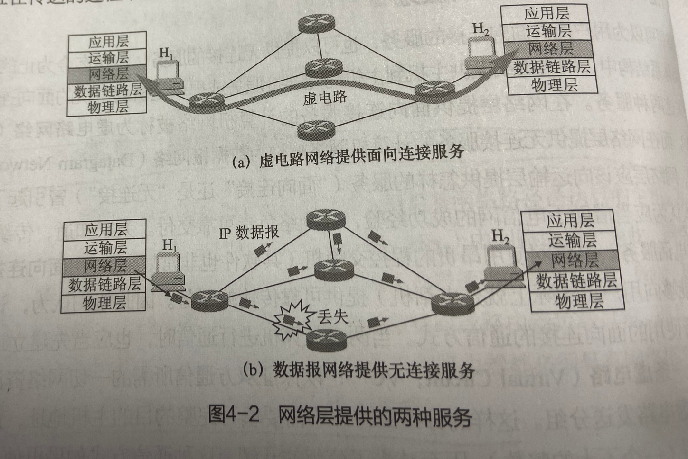
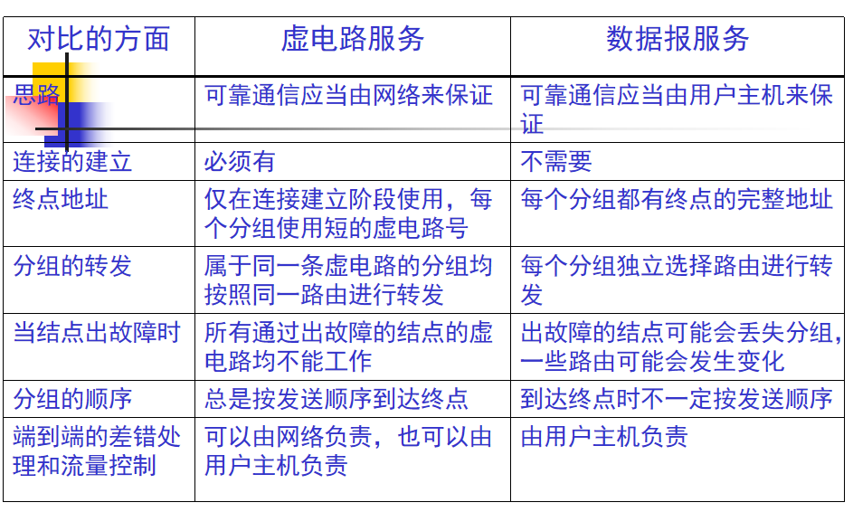
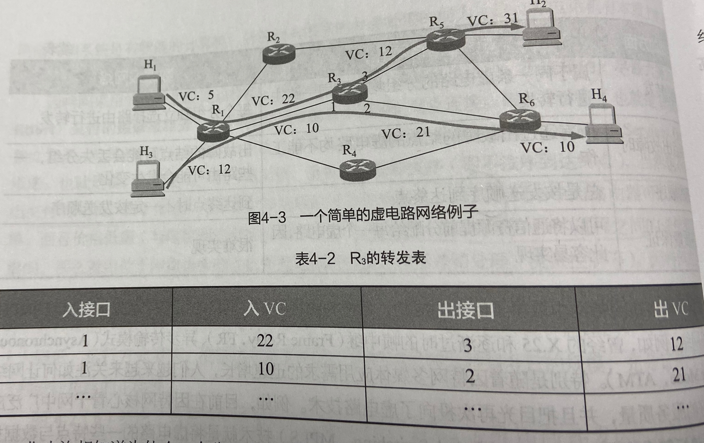

### 分组转发和路由选择

-----------------------
网络层的主要任务就是将分组从源主机传送到目的主机，可以将该任务细分为网络层的两个功能。  
分组转发：一个分组到达某路由器的一条输入链路时，该路由器必须将该分组转发到适当的输出链路，每个路由器有转发表，分组首部带有转发标识。  
路由选择：当分组从发送方流向接收方时，网络层必须决定这些分组所采用的路由或路径。

### 网络层提供的两种服务

-------------------
在网络层提供面先连接服务的计算机网络称为**虚电路网络**  
在网络层提供无连接服务的计算机网络称为**数据报网络**  
虚电路网络提供可靠传输服务，传输分组的首部不需要填写完整的目的主机地址，而只需要填写这条虚电路的编号，因此减少了分组的开销。在通信结束释放虚电路。  
因特网采用了数据报网络，简单灵活、无连接、不可靠交付。如果主机中的进程之间的通信需要进行可靠传输，那么就由位于网络边缘的主机的运输层负责。  

### 虚电路网络

-------------
虚电路是逻辑连接  
虚电路表示这只是一条逻辑上的连接，分组都沿着这条逻辑连接按照存储转发方式传送，而并不是真正建立了一条物理连接。  
请注意，电路交换的电话通信是先建立了一条真正的连接。因此分组交换的虚连接和电路交换的连接只是类似，但并不完全一样。   

虚电路网络的三个阶段：
（1）虚电路建立
（2）数据传送
（3）虚电路拆除

