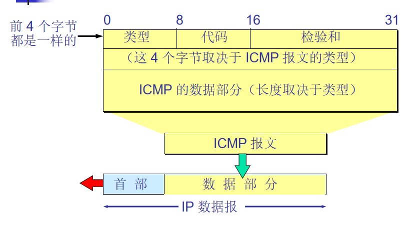
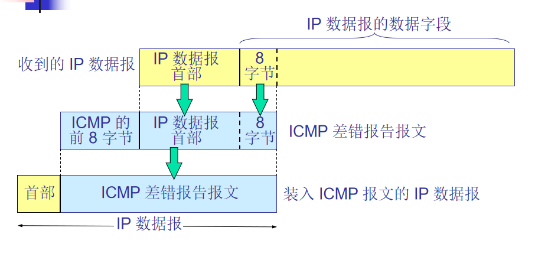

为了提高 IP 数据报交付成功的机会，在网际层使用了网际控制报文协议 ICMP (Internet Control Message Protocol)。  
ICMP 允许主机或路由器报告差错情况和提供有关异常情况的报告。  
ICMP 不是高层协议，而是 IP 层的协议。  
ICMP 报文作为 IP 层数据报的数据，加上数据报的首部，组成 IP 数据报发送出去。  



ICMP 报文的种类有两种，即 ICMP 差错报告报文和 ICMP 询问报文。

|ICMP报文种类|类型的值|ICMP报文的类型|
|----------|---------|----------|
|差错报告报文|3|终点不可达|
|         | 4|源点抑制|
|          |11|超时|
|         |12|参数问题|
|         |5|改变路由|
|询问报文|8或0|回送请求或回答|
|        |13或14|时间戳请求或回答|



```
不应发送 ICMP 差错报告报文的几种情况   
对 ICMP 差错报告报文不再发送 ICMP 差错报告报文。  
对第一个分片的数据报片的所有后续数据报片都不发送 ICMP 差错报告报文。  
对具有多播地址的数据报都不发送 ICMP 差错报告报文。
对具有特殊地址（如127.0.0.0 或 0.0.0.0）的数据报不发送 ICMP 差错报告报文。  
```

ICMP询问报文：  
（1）回送请求和回答。测试目的地是否可达及了解其有关状态。  
（2）时间戳请求和回答。用于时钟同步和侧量时间。  
