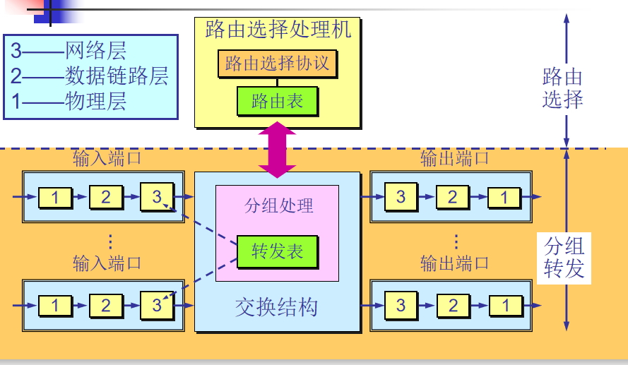
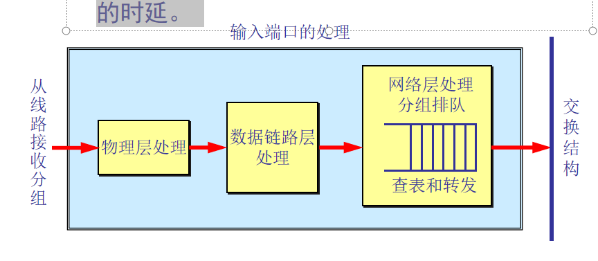
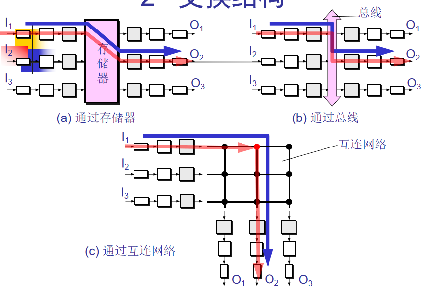
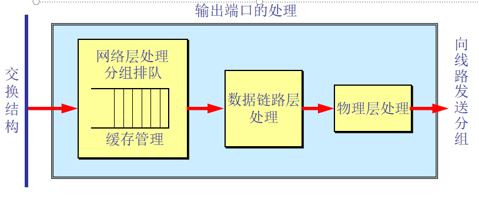

### 路由器的构成

---------------
路由器是一种具有多个输入端口和多个输出端口的专用计算机，其任务是转发分组。
也就是说，将路由器某个输入端口收到的分组，按照分组要去的目的地（即目的网络），把该分组从路由器的某个合适的输出端口转发给下一跳路由器。    
下一跳路由器也按照这种方法处理分组，直到该分组到达终点为止。   

路由器结构划分为两部分：路由选择和分组转发。  



```
“转发”和“路由选择”的区别
“转发”(forwarding)就是路由器根据转发表将用户的 IP 数据报从合适的端口转发出去。
“路由选择”(routing)则是按照分布式算法，根据从各相邻路由器得到的关于网络拓扑的变化情况，动态地改变所选择的路由。
路由表是根据路由选择算法得出的。而转发表是从路由表计算得出的。
在讨论路由选择的原理时，往往不去区分转发表和路由表的区别，    
```

1、输入端口对线路上收到的分组的处理：  
数据链路层剥去帧首部和尾部后，将分组送到网络层的队列中排队等待处理。这会产生一定的时延。   



2、交换结构：  
最早的路由器就是普通的计算机，采用CPU作为选择处理及。当路由器的某个输入端口收到一个分组，就用中断方式通知路由选择处理机，然后把分组  
从输入端口复制到存储器中，路由器从分组中提取目的地址，查找路由表，再把分组复制到合适的输出端口的缓存中。  
1、示意图a与早期的路由器不同的地方是目的地址的查找和分组在存储器的缓存都是输入端口进行的。  
2、示意图b通过总线进行交换，不需要路由选择处理机干预。由于总线是共享的，容易阻塞而不能通过交换结构。要实现无阻塞，交互总线的速率要大于  
所有输入端口速率的总和。  
3、示意图c是通过纵横交换结构进行交换的。可以使n个输入端口和n个输出端口相连接。当输入端口收到一个分组，将它发送到输入端口相连的水平总线  
上。若输出端口的垂直总线是空闲的，则结点将垂直总线和水平总线接通，然后将分组转发到输出端口。若输出垂直总线被占用，则在输入端口排队。  




3、输出端口将交换结构传送来的分组发送到线路：  
当交换结构传送过来的分组先进行缓存。数据链路层处理模块将分组加上链路层的首部和尾部，交给物理层后发送到外部线路。



```
分组丢弃
若路由器处理分组的速率赶不上分组进入队列的速率，则队列的存储空间最终必定减少到零，这就使后面再进入队列的分组由于没有存储空间而只能被丢弃。
路由器中的输入或输出队列产生溢出是造成分组丢失的重要原因。
```

### 路由器和交换机的比较

-----------------------
路由器基于网络层，交换机基于数据链路层。  
交换机最大优点：是即插即用，并具有相对高额分组过滤和转发速率，网络管理员无需进行特殊配置。  
缺点：一个大型交换机网络要求交换机维护大的转发表，也将要求主机维护大的ARP表，并会产生处理大量ARP广播，交换机对广播风暴不提供保护。逻辑拓扑结构被
限制为一棵树，没有冗余链路。  
路由器优点：智能的路由选择，并隔离广播域。可以冗余多条链路  
缺点：处理时间长  

### 三层交换机

---------------
三层交换机逻辑上相当于一个路由器和支持VLAN的二层交换机的集成体。  
三层交换机通常不具有广域网接口，主要用于局域网环境中互连同构的以太网，并起隔离广播域的作用。  
三层交换机处理的都是封装在以太网帧中的IP数据报。速度比传统路由器转发分组快。  

原理：  
当一台主机通过三层交换机与另一个VLAN中的主机进行通信。
三层交换机在处理它们之间的第一个IP数据报时，完全和普通路由器一样，  
要根据目的IP地址使用最长前缀匹配算法查找路由表，获得下一跳IP地址，并使用ARP获取下一跳对应的MAC地址，然后把IP数据报转发出去。  
三层交换机会把目的IP地址与下一跳MAC地址的映射关系记录在高速缓存中。  
后续IP数据报不再通过最长匹配查找路由表，直接从高速缓存中根据目的IP查找下一跳MAC地址。  
并用自己的出口MAC地址和查找到下一跳MAC地址替换包含该IP数据报的以太网帧的源和目的MAC地址，直接在第二层将帧转发出去（几乎不需要第三层）。   
